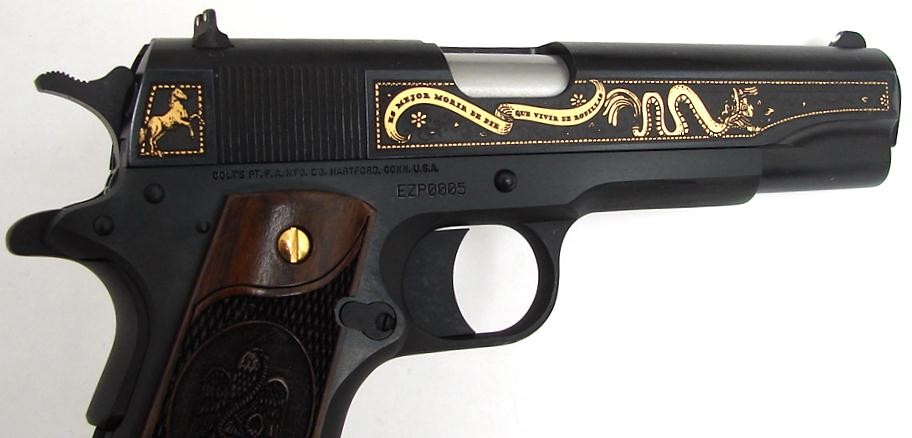

### Smith & Wesson Brands, Inc. v. Estados Unidos Mexicanos, __ U.S. __ (June 5, 2025)

#### Kagan, J., delivered the opinion of the Court.

The Government of Mexico brought this lawsuit against seven American gun manufacturers. As required by a federal statute, Mexico seeks to show (among other things) that the defendant companies participated in the unlawful sale or marketing of firearms. See 15 U.S.C. §7903(5)(A)(iii). More specifically, Mexico alleges that the companies aided and abetted unlawful sales routing guns to Mexican drug cartels. The question presented is whether Mexico's complaint plausibly pleads that conduct. We conclude it does not.

#### I

##### A

The [Protection of Lawful Commerce in Arms Act (PLCAA)](https://www.law.cornell.edu/uscode/text/15/chapter-105), 15 U.S.C. §§7901-7903, bars certain lawsuits against manufacturers and sellers of firearms. Congress enacted the statute in response to a spate of litigation trying to hold gun companies liable in tort for harms "caused by the misuse of firearms by third parties, including criminals." To curb such suits, PLCAA provides that a "qualified civil liability action," as defined in the Act, "may not be brought in any Federal or State court." The Act's definition of that term includes a "civil action or proceeding" against a firearms manufacturer or seller stemming from "the criminal or unlawful misuse" of a firearm by "a third party."

But PLCAA's general bar on those suits has an exception, usually called the predicate exception, relevant here. That exception applies to suits in which the defendant manufacturer or seller "knowingly violated a State or Federal statute applicable to the sale or marketing" of firearms, and that "violation was a proximate cause of the harm for which relief is sought." If a plaintiff can show that provision is satisfied—that, say, a manufacturer committed a gun-sale violation proximately causing the harm at issue—then a suit can proceed, even though it arises from a third party's later misuse of a gun. Or otherwise said, the predicate violation opens a path to making a gun manufacturer civilly liable for the way a third party has used the weapon it made.

Notably here, the predicate violation PLCAA demands may come from aiding and abetting someone else's firearms offense. The predicate exception itself lists as examples two ways in which aiding and abetting qualifies—when a gun manufacturer (or seller) aids and abets another person either in making a false statement about a gun sale's legality or in making specified criminal sales. And more broadly, aiding and abetting can qualify as a PLCAA predicate violation by virtue of another law assimilating an accomplice's liability to a principal's. The federal statute generally accomplishing that task is 18 U.S.C. §2(a), which provides that whoever "aids \[and\] abets" the commission of a federal crime "is punishable as a principal." Because of that provision, a gun manufacturer that aids and abets a federal gun crime may itself commit a PLCAA predicate violation. So principles of aiding and abetting from the criminal law—establishing what counts as aiding and abetting and what does not—may determine whether a plaintiff can satisfy PLCAA's predicate exception and thus proceed with a civil suit otherwise barred. And that dependence on aiding-and-abetting law is a feature of the case before us.

##### B

Mexico has a severe gun violence problem, which its government views as coming from north of the border. The country has only a single gun store, and issues fewer than 50 gun permits each year. But gun traffickers can purchase firearms in the United States—often in illegal transactions—and deliver them to drug cartels in Mexico. Those groups, predictably enough, use the imported firearms to commit serious crimes—drug dealing, kidnapping, murder, and others. According to the Mexican Government, as many as 90% of the guns recovered at crime scenes in Mexico originated in the United States.

The Mexican Government, seeking redress for this gun violence, brought suit in 2021 against seven American firearms manufacturers.[^(n. 1 in opinion) The defendant manufacturers are Smith & Wesson Brands, Inc.; Barrett Firearms Manufacturing, Inc.; Beretta USA Corp.; Century International Arms, Inc.; Colt's Manufacturing Company, LLC; Glock, Inc.; and Sturm, Ruger & Co., Inc. The suit also names as a defendant one gun distributor—Witmer Public Safety Group, Inc., which does business as Interstate Arms. But the complaint barely mentions that company, so for simplicity's sake we refer to all the defendants as manufacturers.] The suit, brought in a U. S. District Court, asserts a variety of tort claims against the defendants, mostly sounding in negligence. The basic theory is that the defendants failed to exercise "reasonable care" to prevent trafficking of their guns into Mexico, and so are responsible for the harms arising there from the weapons' misuse. That theory, as all agree, runs straight into PLCAA's general prohibition. Mexico's action, that is, seeks to hold firearms manufacturers liable for "the criminal or unlawful misuse" of guns by third parties—and so, according to PLCAA, "may not be brought." The complaint thus tries to plead its way into PLCAA's predicate exception. It asserts, as that exception requires, that the third-party misuse of guns in Mexico resulted from the manufacturers' knowing violations of gun laws.

More specifically, the complaint alleges that the manufacturers' firearms violations were ones of aiding and abetting, rather than of independent commission. The manufacturers, according to Mexico, were "willful accessories" in unlawful gun sales by retail dealers, which in turn enabled Mexican criminals to acquire guns (and use them to commit violent offenses). The complaint sets out three kinds of allegations relating to how the manufacturers aided and abetted retailers' unlawful sales.

Mexico's primary line of argument is that the manufacturers supply firearms to retail dealers whom they know illegally sell to Mexican gun traffickers. The complaint explains that the manufacturers use a three-tier distribution system: They sell to wholesale distributors, who sell to retail dealers, who sell to customers. A "small minority" of the dealers are responsible for most of the sales to Mexican traffickers; and those sales often violate federal gun laws—by, for example, involving straw purchasers or proceeding without background checks.[^(n.2 in opinion) A straw purchaser is "a person who buys a gun on someone else's behalf while falsely claiming that it is for himself."] Still more, the complaint alleges—and this is key—that the manufacturers know "who those bad apple dealers are." Yet the manufacturers continue to supply those dealers, as they do legitimate ones, in order to boost their own profits. By choosing not to cut off the flow of firearms to the known rogue dealers, the complaint asserts, the manufacturers become "culpable and intentional participants" in the dealers' federal "statutory violations." [^(n. 3 in opinion) The complaint makes no allegations about the relationship between the manufacturers and the distributors, even though the distributors stand in between the manufacturers and the dealers selling to Mexican traffickers. Neither does the complaint, in setting out the assertions above, distinguish the lone distributor defendant from the manufacturer defendants. Indeed, the complaint says virtually nothing about the distributor's sales practices, to bad-apple dealers or otherwise.]

Second, Mexico claims that the manufacturers have failed to impose the kind of controls on their distribution networks that would prevent illegal sales to Mexican traffickers. There are, Mexico contends, a raft of ways manufacturers could put "commonsense restraints on their supply chains." Brief for Respondent 32. For example, they could prohibit dealers from making "bulk sales" to individual customers, because guns sold in that way (Mexico says) are likely to be "diverted to the illegal market." App. to Pet. for Cert. 86a-87a. So too, they could bar dealers from selling their firearms at gun shows or out of their homes, because those sales (Mexico again says) often ignore regulatory requirements like background checks. And more generally, manufacturers could implement processes for "monitoring or "supervising their dealers' sales practices," so as to minimize illegal sales to traffickers. Yet the defendant manufacturers, Mexico states, have done none of those things. Rather, they have embraced "a seeno-evil, hear-no-evil, speak-no-evil approach" to "their gun distribution system." And that quite "deliberate" approach works to "funnel firearms to the cartels."

And third, Mexico alleges that the manufacturers make "design and marketing decisions" intended to stimulate cartel members' demand for their products. Most prominently, Mexico asserts that the manufacturers have "increased production of military-style" assault weapons, with an eye toward cultivating the criminal market. For example, one manufacturer has made a ".50 caliber long range sniper rifle," which cartels have used to attack the police and military. In addition, Mexico says, the manufacturers make guns whose serial numbers can be "obliterated or defaced," thus hindering police tracing efforts. And the manufacturers produce firearms whose names or aesthetic features appeal to cartel members. Colt, for example, makes the ".38 caliber Super 'El Jefe' pistol; the .38 caliber Super 'El Grito' pistol; and the .38 caliber 'Emiliano Zapata 1911' pistol"—the last of which includes Zapata's image and the words "It is better to die standing than to live on your knees."[]{.aside}

The defendant manufacturers moved to dismiss Mexico's complaint, contending that PLCAA barred the suit. The District Court granted the motion. But the Court of Appeals for the First Circuit reversed. It found that Mexico's complaint plausibly "alleged that defendants have been aiding and abetting the illegal sale of firearms by dealers." And because, in the court's view, the complaint also plausibly alleged that the defendants' aiding-and-abetting conduct proximately caused injury to Mexico, PLCAA's predicate exception was satisfied. As a result, Mexico's suit against the manufacturers could go forward.

#### II

Mexico's complaint survives PLCAA only if, in accord with usual pleading rules, it has plausibly alleged conduct falling within the statute's predicate exception. See _Ashcroft_ v. _Iqbal,_ 556 U. S. 662 (2009). Because Mexico relies exclusively on an aiding-and-abetting theory, that means plausibly alleging that the manufacturers have aided and abetted gun dealers' firearms offenses (such as sales to straw purchasers), so as to proximately cause harm to Mexico. We need not address the proximate cause question, because we find that Mexico has not plausibly alleged aiding and abetting on the manufacturers' part. "Plausibly" does not mean "probably," but "it asks for more than a sheer possibility that a defendant has acted unlawfully." And Mexico has not met that bar. Its complaint does not plausibly allege the kind of "conscious ... and culpable participation in another's wrongdoing" needed to make out an aiding-and-abetting charge.

#### A

Federal aiding-and-abetting law "reflects a centuries-old view of culpability: that a person may be responsible for a crime he has not personally carried out" if he deliberately "helps another to complete its commission." To aid and abet a crime, a person must "take an affirmative act in furtherance of that offense." And he must "intend to facilitate the offense's commission." Or as Judge Learned Hand stated those requisites, in what has become a canonical formulation, an aider and abettor must "participate in" a crime "as in something that he wishes to bring about" and "seek by his action to make it succeed." 

In elaborating on that demand, this Court has developed several ancillary principles. First, aiding and abetting is most commonly "a rule of secondary liability for _specific_ wrongful acts." It is possible for someone to aid and abet a broad category of misconduct, but then his participation must be correspondingly "pervasive, systemic, and culpable." Second, aiding and abetting usually requires misfeasance rather than nonfeasance. Absent an "independent duty to act," a person's "failures," "omissions," or "inactions"— even if in some sense blameworthy—will rarely support aiding-and-abetting liability. And third, routine and general activity that happens on occasion to assist in a crime—in essence, "incidentally"—is unlikely to count as aiding and abetting. So, for example, an "ordinary merchant" does not "become liable" for all criminal "misuses of his goods," even if he knows that in some fraction of cases misuse will occur. The merchant becomes liable only if, beyond providing the good on the open market, he takes steps to "promote" the resulting crime and "make it his own." 

Two of our cases—one approving liability for aiding another's crime, the other not—illustrate how all this doctrine plays out in practice. In _Direct Sales Co. v. United States,_ 319 U. S. 703 (1943), we held that a mail-order pharmacy could be convicted for assisting a small-town doctor's illegal distribution of narcotics. The pharmacy, Direct Sales, sold huge amounts of morphine to Dr. John Tate: Whereas the average physician required no more than 400 quarter-grain tablets annually, Direct Sales sold Tate some 5,000 to 6,000 half-grain tablets every month. Still more, Direct Sales "actively stimulated" Tate's purchases, by giving him special discounts for his most massive orders and using "high-pressure sales methods." And it did all that against the backdrop of law enforcement warnings: The Bureau of Narcotics had informed Direct Sales that "it was being used as a source of supply" by lawbreaking doctors. All that evidence, this Court found, was enough to sustain Direct Sales's conviction. It showed that Direct Sales "not only knew of and acquiesced" in Tate's "illicit enterprise," but "joined both mind and hand with him to make its accomplishment possible."

By contrast, this Court recently ordered the dismissal of a suit against several social-media companies for aiding and abetting a terrorist attack carried out by ISIS. See [_Twitter, Inc. v. Taamneh_, 598 US 471](https://scholar.google.com/scholar_case?case=2294521463212185116). The plaintiffs, victims of the attack, alleged that adherents of ISIS used the companies' platforms for recruiting and fundraising. The complaint further asserted that the companies knew that was so, yet failed to identify and remove the ISIS-related accounts and content. But we held that was not enough to make the companies liable for ISIS's terrorist acts. The companies' relationship with ISIS and its supporters, we reasoned, was "the same as their relationship with their billion-plus other users: arm's length, passive, and largely indifferent." There were no allegations that the companies had given ISIS "any special treatment," or "encouraged, solicited, or advised" the group. Instead, after providing their platforms for general use, the companies "at most allegedly stood back and watched." More was needed, we stated, for a provider of generally available goods or services to be liable for a customer's misuse of them—for example, conduct of the kind in _Direct Sales._ When a company merely knows that "some bad actors" are taking "advantage" of its products for criminal purposes, it does not aid and abet. And that is so even if the company could adopt measures to reduce their users' downstream crimes.

##### B

Viewed against the backdrop of that law, Mexico's complaint does not plausibly allege that the defendant manufacturers aided and abetted gun dealers' unlawful sales of firearms to Mexican traffickers. We have little doubt that, as the complaint asserts, some such sales take place—and that the manufacturers know they do. But still, Mexico has not adequately pleaded what it needs to: that the manufacturers "participate in" those sales "as in something that they wish to bring about," and "seek by their action to make" succeed.

To begin with, Mexico's complaint sets for itself a high bar. The complaint does not pinpoint, as most aiding-and-abetting claims do, any specific criminal transactions that the defendants (allegedly) assisted. It does not say, for example, that a given manufacturer aided a given firearms dealer, at a particular time and place, in selling guns to a given Mexican trafficker not legally permitted to buy them under a specified statute. Instead, the complaint levels a more general accusation: that all the manufacturers assist some number of unidentified rogue gun dealers in making a host of firearms sales in violation of various legal bars. The systemic nature of that charge is not necessarily fatal. But as noted earlier, it cannot help but heighten Mexico's burden. To survive, the charge must be backed by plausible allegations of "pervasive, systemic, and culpable assistance."

Mexico's lead claim—that the manufacturers elect to sell guns to, among others, known rogue dealers—fails to clear that bar, for a package of reasons. For one thing, it is far from clear that such behavior, without more, could ever count as aiding and abetting under our precedents. _Direct Sales_ is the case Mexico relies on. But that case was more particularized than this one, involving as it did the aid given to a single named offender in violating a specified narcotics law. And yet more important, the abettor there did more than sell a product to a known lawbreaker, as it would to all others. The pharmacy, recall, not only supplied Dr. Tate, but also "actively stimulated" his far-greater-than-average purchases.  Mexico's complaint asserts nothing similar here. To the contrary, the complaint repeatedly states that the manufacturers treat rogue dealers just the same as they do lawa-biding ones—selling to everyone, and on equivalent terms. See App. to Pet. for Cert. 44a-46a, 79a, 83a-84a, 139a-141a. So the complaint, even if taken at face value, would stretch the bounds of our caselaw.

And in any event, we cannot take the allegation here at face value, because Mexico has not said enough to make it plausible. In asserting that the manufacturers intentionally supply guns to bad-apple dealers, Mexico never confronts that the manufacturers do not directly supply any dealers, bad-apple or otherwise. They instead sell firearms to middlemen distributors, whom Mexico has never claimed lack independence. Given that industry structure, Mexico's complaint must offer some reason to believe that the manufacturers attend to the conduct of individual gun dealers, two levels down. But it does not so much as address that issue. And even assuming the manufacturers know everything the distributors know, the complaint still would not adequately support the charge that they have identified the bad-apple dealers. Mexico does not itself name those dealers, though they are the ostensible principals in the illegal transactions claimed.[^(n. 5 in opinion) At one point, Mexico's complaint cites a Washington Post article from 2010 naming "12 dealers that sold the most guns recovered" at crime scenes in Mexico. But the article itself explains that those dealers could have made the list because of "sales volume or geography" rather than especial wrongdoing. J. Grimaldi & S. Horwitz, Mexican Cartels Wielding American Weapons, Washington Post, Dec. 13, 2010, p. A10, col. 1.]  Nor does Mexico provide grounds for thinking that anyone up the supply chain—whether manufacturer or distributor— often acquires that information. Indeed, the complaint points out that government agencies only sporadically provide upstream companies with information tracing Mexican crime guns to certain dealers. So Mexico's allegation on this score is all speculation; even on a motion to dismiss, it is not enough.

What Mexico has plausibly pleaded respecting sales to offenders is a lesser wrong, which does not rise to the level of aiding and abetting. Mexico's complaint alleges that some, though unidentified, dealers often engage in illegal transactions with Mexican traffickers. So too, the complaint alleges that the manufacturers know that much to be true—that among the whole class of dealers, there are some who routinely violate the law. And finally the complaint alleges, with sufficient plausibility, that the manufacturers could do more than they do to figure out who those rogue dealers are, and then to cut off their supply of guns. But that is to say little more than the plaintiffs said in _Twitter._ According to the complaint there, the social-media companies knew that among their customers were ISIS supporters, whom they could have done more to identify and remove. Still, we decided, that "nonfeasance" was not enough to hold the companies responsible for the terrorists' unlawful acts. And the same is true here, for the same reasons. Mexico's plausible allegations are of "indifference," rather than assistance. They are of the manufacturers' merely allowing some unidentified "bad actors" to make illegal use of their wares.

For related reasons, Mexico's second set of allegations— that the manufacturers have declined to suitably regulate the dealers' practices—cannot fill the gap. Of course, responsible manufacturers might well impose constraints on their distribution chains to reduce the possibility of unlawful conduct. (Mexico's prime examples, recall, are bans on bulk sales or sales from homes—permitted under federal law, but in Mexico's view conducive to unlawful transactions.) So too, those manufacturers might decide, as Mexico urges, to themselves monitor dealers' sales for law violations. But a failure to do so is, again, what _Twitter_ called "passive nonfeasance"—a "failure to stop" independent retailers downstream from making unlawful sales. Such "omissions" and "inactions," especially in an already highly regulated industry, are rarely the stuff of aiding-and-abetting liability. And nothing special in Mexico's allegations makes them so. A manufacturer of goods is not an accomplice to every unaffiliated retailer whom it fails to make follow the law.

Finally, Mexico's allegations about the manufacturers' "design and marketing decisions" add nothing of consequence. As noted above, Mexico here focuses on the manufacturers' production of "military style" assault weapons, among which it includes AR-15 rifles, AK-47 rifles, and .50 caliber sniper rifles. But those products are both widely legal and bought by many ordinary consumers. (The AR-15 is the most popular rifle in the country. See T. Gross, How the AR-15 Became the Bestselling Rifle in the U.S.) The manufacturers cannot be charged with assisting in criminal acts just because Mexican cartel members like those guns too. The same is true of firearms with Spanish-language names or graphics alluding to Mexican history. Those guns may be "coveted by the cartels," as Mexico alleges; but they also may appeal, as the manufacturers rejoin, to "millions of law-abiding Hispanic Americans." That leaves only the allegation that the manufacturers have not attempted to make guns with nondefaceable serial numbers. But the failure to improve gun design in that way (which federal law does not require) cannot in the end show that the manufacturers have "joined both mind and hand" with lawbreakers in the way needed to aid and abet.

##### C

All of that means PLCAA prevents Mexico's suit from going forward. The kinds of allegations Mexico makes cannot satisfy the demands of the statute's predicate exception. That exception permits a suit to be brought against a gun manufacturer that has aided and abetted a firearms violation (and in so doing proximately caused the plaintiff's harm). And Mexico's complaint, for the reasons given, does not plausibly allege such aiding and abetting. So this suit remains subject to PLCAA's general bar: An action cannot be brought against a manufacturer if, like Mexico's, it is founded on a third-party's criminal use of the company's product.

And that conclusion, we note, well accords with PLCAA's core purpose. Recall that Congress enacted the statute to halt a flurry of lawsuits attempting to make gun manufacturers pay for the downstream harms resulting from misuse of their products. In a "findings" and "purposes" section, Congress explained that PLCAA was meant to stop those suits—to prevent manufacturers (and sellers) from being held "liable for the harm caused by those who criminally or unlawfully misuse firearms." Mexico's suit closely resembles the ones Congress had in mind: It seeks to recover from American firearms manufacturers for the downstream damage Mexican cartel members wreak with their guns. Of course, the law Congress wrote includes the predicate exception, which allows some suits falling within PLCAA's general ban to proceed. But that exception, if Mexico's suit fell within it, would swallow most of the rule. We doubt Congress intended to draft such a capacious way out of PLCAA, and in fact it did not. The predicate exception allows for accomplice liability only when a plaintiff makes a plausible allegation that a gun manufacturer "participated in" a firearms violation "as in something that it wished to bring about" and sought to make succeed. Because Mexico's complaint fails to do so, the defendant manufacturers retain their PLCAA-granted immunity.