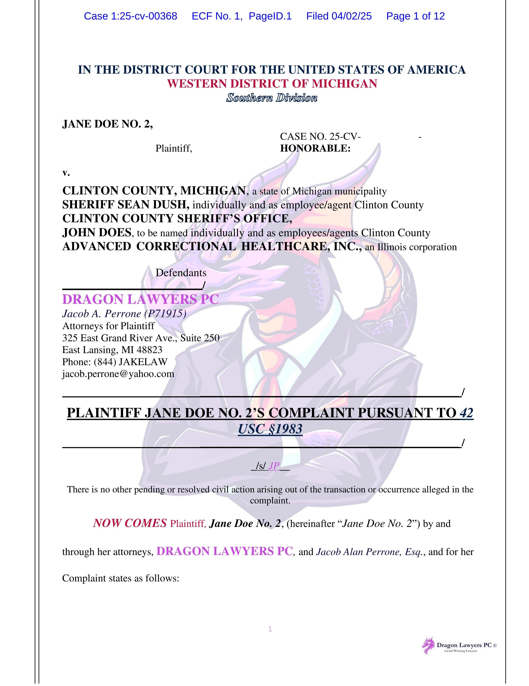

# Pleading

## Pleading Under the Federal Rules 

::: {.legalcode}

#### Fed. R. Civ. P. Rule 3

A civil action is commenced by filing a complaint with the court.

#### Fed. R. Civ. P. Rule 7

- (a\) Pleadings. Only these pleadings are allowed:
	- (1\) a complaint;
	- (2\) an answer to a complaint;
	- (3\) an answer to a counterclaim designated as a counterclaim;
	- (4\) an answer to a crossclaim;
	- (5\) a third-party complaint;
	- (6\) an answer to a third-party complaint; and
	- (7\) if the court orders one, a reply to an answer.
- (b\) Motions and Other Papers.
	- (1\) In General. A request for a court order must be made by motion. The motion must:
		- (A\) be in writing unless made during a hearing or trial;
		- (B\) state with particularity the grounds for seeking the order; and
		- (C\) state the relief sought.
	- (2\) Form. The rules governing captions and other matters of form in pleadings apply to motions and other papers.

#### Fed. R. Civ. P. Rule 8

- (a\) Claim for Relief. A pleading that states a claim for relief must contain:
	- (1\) a short and plain statement of the grounds for the court's jurisdiction, unless the court already has jurisdiction and the claim needs no new jurisdictional support;
	- (2\) a short and plain statement of the claim showing that the pleader is entitled to relief; and
	- (3\) a demand for the relief sought, which may include relief in the alternative or different types of relief.
- (b\) Defenses; Admissions and Denials.
	- (1\) In General. In responding to a pleading, a party must:
		- (A\) state in short and plain terms its defenses to each claim asserted against it; and
		- (B\) admit or deny the allegations asserted against it by an opposing party.
	- (2\) Denials—Responding to the Substance. A denial must fairly respond to the substance of the allegation.
	- (3\) General and Specific Denials. A party that intends in good faith to deny all the allegations of a pleading—including the jurisdictional grounds—may do so by a general denial. A party that does not intend to deny all the allegations must either specifically deny designated allegations or generally deny all except those specifically admitted.
	- (4\) Denying Part of an Allegation. A party that intends in good faith to deny only part of an allegation must admit the part that is true and deny the rest.
	- (5\) Lacking Knowledge or Information. A party that lacks knowledge or information sufficient to form a belief about the truth of an allegation must so state, and the statement has the effect of a denial.
	- (6\) Effect of Failing to Deny. An allegation—other than one relating to the amount of damages—is admitted if a responsive pleading is required and the allegation is not denied. If a responsive pleading is not required, an allegation is considered denied or avoided.
- (c\) Affirmative Defenses.
	- (1\) In General. In responding to a pleading, a party must affirmatively state any avoidance or affirmative defense, including:
		- • accord and satisfaction; 
		- • arbitration and award;
		- • assumption of risk;
		- • contributory negligence;
		- • duress;
		- • estoppel;
		- • failure of consideration;
		- • fraud;
		- • illegality;
		- • injury by fellow servant;
		- • laches;
		- • license;
		- • payment;
		- • release;
		- • res judicata;
		- • statute of frauds;
		- • statute of limitations; and
		- • waiver.
	- (2\) Mistaken Designation. If a party mistakenly designates a defense as a counterclaim, or a counterclaim as a defense, the court must, if justice requires, treat the pleading as though it were correctly designated, and may impose terms for doing so.
- (d\) Pleading to Be Concise and Direct; Alternative Statements; Inconsistency.
	- (1\) _In General._ Each allegation must be simple, concise, and direct. No technical form is required.
	- (2\) _Alternative Statements of a Claim or Defense._ A party may set out 2 or more statements of a claim or defense alternatively or hypothetically, either in a single count or defense or in separate ones. If a party makes alternative statements, the pleading is sufficient if any one of them is sufficient.
	- (3\) _Inconsistent Claims or Defenses._ A party may state as many separate claims or defenses as it has, regardless of consistency.
- (e\) Construing Pleadings. Pleadings must be construed so as to do justice.

#### Fed. R. Civ. P. Rule 9

- (a\) Capacity or Authority to Sue; Legal Existence.
	- (1\) _In General._ Except when required to show that the court has jurisdiction, a pleading need not allege:
		- (A\) a party's capacity to sue or be sued;
		- (B\) a party's authority to sue or be sued in a representative capacity; or
		- (C\) the legal existence of an organized association of persons that is made a party.
	- (2\) _Raising Those Issues._ To raise any of those issues, a party must do so by a specific denial, which must state any supporting facts that are peculiarly within the party's knowledge.
- (b\) Fraud or Mistake; Conditions of Mind. In alleging fraud or mistake, a party must state with particularity the circumstances constituting fraud or mistake. Malice, intent, knowledge, and other conditions of a person's mind may be alleged generally.
- (c\) Conditions Precedent. In pleading conditions precedent, it suffices to allege generally that all conditions precedent have occurred or been performed. But when denying that a condition precedent has occurred or been performed, a party must do so with particularity.
- (e\) OMITTED
- (f\) Time and Place. An allegation of time or place is material when testing the sufficiency of a pleading.
- (g\) Special Damages. If an item of special damage is claimed, it must be specifically stated.

#### Fed. R. Civ. P. Rule 10

- (a\) Caption; Names of Parties. Every pleading must have a caption with the court's name, a title, a file number, and a Rule 7(a) designation. The title of the complaint must name all the parties; the title of other pleadings, after naming the first party on each side, may refer generally to other parties.
- (b\) Paragraphs; Separate Statements. A party must state its claims or defenses in numbered paragraphs, each limited as far as practicable to a single set of circumstances. A later pleading may refer by number to a paragraph in an earlier pleading. If doing so would promote clarity, each claim founded on a separate transaction or occurrence—and each defense other than a denial—must be stated in a separate count or defense.
- (c\) Adoption by Reference; Exhibits. A statement in a pleading may be adopted by reference elsewhere in the same pleading or in any other pleading or motion. A copy of a written instrument that is an exhibit to a pleading is a part of the pleading for all purposes.

#### Fed. R. Civ. P. Rule 12

- (a\) Time to Serve a Responsive Pleading.
	- (1\) In General. Unless another time is specified by this rule or a federal statute, the time for serving a responsive pleading is as follows:
		- (A\) A defendant must serve an answer:
			- (i\) within 21 days after being served with the summons and complaint; or
			- (ii\) if it has timely waived service under Rule 4(d), within 60 days after the request for a waiver was sent, or within 90 days after it was sent to the defendant outside any judicial district of the United States.
		- (B\) A party must serve an answer to a counterclaim or crossclaim within 21 days after being served with the pleading that states the counterclaim or crossclaim.
		- (C\) A party must serve a reply to an answer within 21 days after being served with an order to reply, unless the order specifies a different time.
	- (4\) Effect of a Motion. Unless the court sets a different time, serving a motion under this rule alters these periods as follows:
		- (A\) if the court denies the motion or postpones its disposition until trial, the responsive pleading must be served within 14 days after notice of the court's action; or
		- (B\) if the court grants a motion for a more definite statement, the responsive pleading must be served within 14 days after the more definite statement is served.
- (b\) How to Present Defenses. Every defense to a claim for relief in any pleading must be asserted in the responsive pleading if one is required. But a party may assert the following defenses by motion:
	- (1\) lack of subject-matter jurisdiction;
	- (2\) lack of personal jurisdiction;
	- (3\) improper venue;
	- (4\) insufficient process;
	- (5\) insufficient service of process;
	- (6\) failure to state a claim upon which relief can be granted; and
	- (7\) failure to join a party under Rule 19.
	- A motion asserting any of these defenses must be made before pleading if a responsive pleading is allowed. If a pleading sets out a claim for relief that does not require a responsive pleading, an opposing party may assert at trial any defense to that claim. No defense or objection is waived by joining it with one or more other defenses or objections in a responsive pleading or in a motion.
- (c\) & (d\) OMITTED
- (e\) Motion for a More Definite Statement. A party may move for a more definite statement of a pleading to which a responsive pleading is allowed but which is so vague or ambiguous that the party cannot reasonably prepare a response. The motion must be made before filing a responsive pleading and must point out the defects complained of and the details desired. If the court orders a more definite statement and the order is not obeyed within 14 days after notice of the order or within the time the court sets, the court may strike the pleading or issue any other appropriate order.
- (f\) Motion to Strike. The court may strike from a pleading an insufficient defense or any redundant, immaterial, impertinent, or scandalous matter. The court may act:
	- (1\) on its own; or
	- (2\) on motion made by a party either before responding to the pleading or, if a response is not allowed, within 21 days after being served with the pleading.
- (g\) Joining Motions.
	- (1\) Right to Join. A motion under this rule may be joined with any other motion allowed by this rule.
	- (2\) Limitation on Further Motions. Except as provided in Rule 12(h)(2) or 
	- (3\) a party that makes a motion under this rule must not make another motion under this rule raising a defense or objection that was available to the party but omitted from its earlier motion.
- (h\) Waiving and Preserving Certain Defenses.
	- (1\) When Some Are Waived. A party waives any defense listed in Rule 12(b)(2)–(5) by:
		- (A\) omitting it from a motion in the circumstances described in Rule 12(g)(2); or
		- (B\) failing to either:
			- (i\) make it by motion under this rule; or
			- (ii\) include it in a responsive pleading or in an amendment allowed by Rule 15(a)(1) as a matter of course.
	- (2\) When to Raise Others. Failure to state a claim upon which relief can be granted, to join a person required by Rule 19(b), or to state a legal defense to a claim may be raised:
		- (A\) in any pleading allowed or ordered under Rule 7(a);
		- (B\) by a motion under Rule 12(c); or
		- (C\) at trial.
	- (3\) Lack of Subject-Matter Jurisdiction. If the court determines at any time that it lacks subject-matter jurisdiction, the court must dismiss the action.

:::

#### @DoeClintonCounty_WDMich2025

[Order Striking Complaint]{.casesection}

Each page of plaintiff's complaint appears on an e-filing which is dominated by a large multi-colored cartoon dragon dressed in a suit, presumably because she is represented by the law firm of "Dragon Lawyers PC© Award Winning Lawyers". Fed. R. Civ. P. 12(f)(1) allows a court to "strike from a pleading ... any redundant, immaterial, impertinent, or scandalous matter." Use of this dragon cartoon logo is not only distracting, it is juvenile and impertinent. The Court is not a cartoon. Accordingly, 

**IT IS ORDERED** that plaintiff's complaint is **STRICKEN**. Plaintiff is directed to file an amended complaint, containing the same allegations as the original complaint, without the cartoon dragon by no later than May 5, 2025. 

**IT IS FURTHER ORDERED** that plaintiff shall not file any other documents with the cartoon dragon or other inappropriate content. 

::: {.callout-note}

Surprisingly, the court did not mention the egregious use of colored type in the complaint. Many courts have local rules governing the typography and formatting of pleadings, motions, briefs, and other documents. @Butterick2015 is a useful guide to producing attractive, reader-friendly, legal documents.

:::

#### @TrumpNewYorkTimes_MDFla2025

As every member of the bar of every federal court knows (or is presumed to know), Rule 8(a), Federal Rules of Civil Procedure, requires that a complaint include "a short and plain statement of the claim showing that the pleader is entitled to relief." Rule 8(e)(1) helpfully adds that "each averment of a pleading shall be simple, concise, and direct." Some pleadings are necessarily longer than others. The difference likely depends on the number of parties and claims, the complexity of the governing facts, and the duration and scope of pertinent events. But both a shorter pleading and a longer pleading must comprise "simple, concise, and direct" allegations that offer a "short and plain statement of the claim." Rule 8 governs every pleading in a federal court, regardless of the amount in controversy, the identity of the parties, the skill or reputation of the counsel, the urgency or importance (real or imagined) of the dispute, or any public interest at issue in the dispute.

In this action, a prominent American citizen (perhaps the most prominent American citizen) alleges defamation by a prominent American newspaper publisher (perhaps the most prominent American newspaper publisher) and by several other corporate and natural persons. Alleging only two simple counts of defamation, the complaint consumes eighty-five pages.[You can read the complaint [here](../exhibits/Trump-v-NYT-complaint.pdf).]{.aside} Count I appears on page eighty, and Count II appears on page eighty-three. Pages one through seventy-nine, plus part of page eighty, present allegations common to both counts and to all defendants. Each count alleges a claim against each defendant and, apparently, each claim seeks the same remedy against each defendant.

Even under the most generous and lenient application of Rule 8, the complaint is decidedly improper and impermissible. The pleader initially alleges an electoral victory by President Trump "in historic fashion"—by "trouncing" the opponent—and alludes to "persistent election interference from the legacy media, led most notoriously by the New York Times." The pleader alludes to "the halcyon days" of the newspaper but complains that the newspaper has become a "full-throated mouthpiece of the Democrat party," which allegedly resulted in the "deranged endorsement" of President Trump's principal opponent in the most recent presidential election. The reader of the complaint must labor through allegations, such as "a new journalistic low for the hopelessly compromised and tarnished 'Gray Lady.'" The reader must endure an allegation of "the desperate need to defame with a partisan spear rather than report with an authentic looking glass" and an allegation that "the false narrative about 'The Apprentice' was just the tip of Defendants' melting iceberg of falsehoods." Similarly, in one of many, often repetitive, and laudatory (toward President Trump) but superfluous allegations, the pleader states, "'The Apprentice' represented the cultural magnitude of President Trump's singular brilliance, which captured the _Zeitgeist_ of our time."

The complaint continues with allegations in defense of President Trump's father and the acquisition of the Trumps' wealth; with a protracted list of the many properties owned, developed, or managed by The Trump Organization and a list of President Trump's many books; with a long account of the history of "The Apprentice"; with an extensive list of President Trump's "media appearances"; with a detailed account of other legal actions both by and against President Trump, including an account of the "Russia Collusion Hoax" and incidents of alleged "lawfare" against President Trump; and with much more, persistently alleged in abundant, florid, and enervating detail.

Even assuming that each allegation in the complaint is true (of course, that is for a jury to decide and is not pertinent here; this order suggests nothing about the truth of the allegations or the validity of the claims but addresses only the manner of the presentation of the allegations in the complaint); even assuming that at trial the plaintiff offers evidence supporting every allegation in the complaint and that the evidence is accepted by the jury as fact; and even assuming that after finally "melting" the defendants' alleged "iceberg of falsehoods" the plaintiff prevails for each reason alleged in the complaint—even assuming all of that—a complaint remains an improper and impermissible place for the tedious and burdensome aggregation of prospective evidence, for the rehearsal of tendentious arguments, or for the protracted recitation and explanation of legal authority putatively supporting the pleader's claim for relief. As every lawyer knows (or is presumed to know), a complaint is not a public forum for vituperation and invective—not a protected platform to rage against an adversary. A complaint is not a megaphone for public relations or a podium for a passionate oration at a political rally or the functional equivalent of the Hyde Park Speakers' Corner.

A complaint is a mechanism to fairly, precisely, directly, soberly, and economically inform the defendants—in a professionally constrained manner consistent with the dignity of the adversarial process in an Article III court of the United States—of the nature and content of the claims. A complaint is a short, plain, direct statement of allegations of fact sufficient to create a facially plausible claim for relief and sufficient to permit the formulation of an informed response. Although lawyers receive a modicum of expressive latitude in pleading the claim of a client, the complaint in this action extends far beyond the outer bound of that latitude.

This complaint stands unmistakably and inexcusably athwart the requirements of Rule 8. This action will begin, will continue, and will end in accord with the rules of procedure and in a professional and dignified manner. The complaint is STRUCK with leave to amend within twenty-eight days. The amended complaint must not exceed forty pages, excluding only the caption, the signature, and any attachment.

## Assessing the Sufficiency of a Claim

Under Rule 8(a), a "pleading that states a claim for relief must contain [...] a short and plain statement of the claim showing that the pleader is entitled to relief". This requirement applies to any party (whether in the position of plaintiff or defendant) who asserts a claim, counterclaim, crossclaim, or third-party claim.

A defending party may challenge the sufficiency of a claim under Rule 8(a)(2) with a motion to dismiss for "failure to state a claim upon which relief can be granted". Fed. R. Civ. P. Rule 12(b)(6). A claim may be dismissed on this basis for either factual or legal insufficiency:

- A claim is _factually insufficient_ if the facts alleged, even assuming they are true, would not satisfy the elements of a claim. For example, if a plaintiff asserts a claim for negligence, but fails to allege any injury resulting from the defendant's conduct, the claim would be factually insufficient, because injury is a necessary element of the claim.

- A claim is _legally insufficient_ if the law does not recognize the purported claim at all. For example, if a plaintiff sues for "tortious bad taste in music", alleging that the defendant incessantly played "We Built this City" by The Starship and "Rockstar" by Nickleback, the claim would be legally insufficient, because the law (regrettably) doesn't recognize any such claim.

In _Conley v. Gibson_, 355 U.S. 41 (1957), the Supreme Court interpreted Rule 8(a)(2) to establish a "notice pleading" pleading standard, requiring only that the plaintiff "give the defendant fair notice of what the claim is and the grounds upon which it rests," without the necessity for detailed factual allegations. This standard rested on the structure of the Federal Rules of Civil Procedure, under which the assertion of claims and the disclosure of facts are allocated to separate phases of a suit. At the pleading stage, "a complaint should not be dismissed for failure to state a claim unless it appears beyond doubt that the plaintiff can prove no set of facts in support of his claim which would entitle him to relief." The discovery rules then give the parties an opportunity to establish the facts in full. 

A half-century later, a pair of Supreme Court decisions jettisoned the _Conley_ "no set of facts" standard and adopted a more demanding approach. 

#### @BellAtlanticCorpTwombly_US2007

In _Twombly_, the plaintiffs alleged that four telecommunications companies had "engaged in a contract, combination or conspiracy to prevent competitive entry in their respective local telephone and/or high speed internet services markets by, among other things, agreeing not to compete with one another and to stifle attempts by others to compete with them and otherwise allocating customers and markets to one another in violation of Section 1 of the Sherman Antitrust Act, [15 U.S.C. §1](https://www.law.cornell.edu/uscode/text/15/1)." In support of that claim, the complaint alleged that the defendants "engaged in parallel conduct" to restrict competition, including "making unfair agreements with [competing providers] for access to [the defendants'] networks, providing inferior connections to the networks, overcharging, and billing in ways designed to sabotage the [competing providers'] relations with their own customers." The complaint also alleged that the defendants agreed to refrain from competing with one another, by not pursuing business opportunities in markets already serviced by other defendants. 

> In the absence of any meaningful competition between [the defendants] in one another's markets, and in light of the parallel course of conduct that each engaged in to prevent competition from [other providers] within their respective local telephone and/or high speed internet services markets and the other facts and market circumstances alleged above, Plaintiffs allege upon information and belief that Defendants have entered into a contract, combination or conspiracy to prevent competitive entry in their respective local telephone and/or high speed internet services markets and have agreed not to compete with one another and otherwise allocated customers and markets to one another.

The Court held that the allegations in the complaint were insufficient to state a claim under §1 of the Sherman Act, which requires proof of a "contract, combination, or conspiracy, in restraint of trade or commerce". 

> A plaintiff's obligation to provide the "grounds" of his "entitlement to relief" requires more than labels and conclusions, and a formulaic recitation of the elements of a cause of action will not do. Factual allegations must be enough to raise a right to relief above the speculative level, on the assumption that all the allegations in the complaint are true (even if doubtful in fact).
> 
> An allegation of parallel conduct and a bare assertion of conspiracy will not suffice [to state a claim under Sherman Act §1]. Without more, parallel conduct does not suggest conspiracy, and a conclusory allegation of agreement at some unidentified point does not supply facts adequate to show illegality. Hence, when allegations of parallel conduct are set out in order to make a §1 claim, they must be placed in a context that raises a suggestion of a preceding agreement, not merely parallel conduct that could just as well be independent action." 
 
To assess whether the inference of an agreement was plausible, the majority considered "an obvious alternative explanation": While the alleged parallel conduct was "consistent with conspiracy," it was, in the majority's view, "as much in line with a wide swath of rational and competitive business strategy unilaterally prompted by common perceptions of the market." Finding that "the plaintiffs here have not nudged their claims across the line from conceivable to plausible," the majority concluded that "their complaint must be dismissed."

#### @AshcroftIqbal_US2009

Javaid Iqbal sued various federal government officials, including former Attorney General John Ashcroft and FBI Director Robert Mueller, over his arrest and detention as a "a person 'of high interest' to the September 11 investigation". Iqbal, a citizen of Pakistan and a Muslim, alleged that Ashcroft and Mueller "adopted an unconstitutional policy that subjected him to harsh conditions of confinement on account of his race, religion, or national origin." 

> The complaint contends that petitioners designated respondent a person of high interest on account of his race, religion, or national origin, in contravention of the First and Fifth Amendments to the Constitution. The complaint alleges that "the FBI, under the direction of Defendant MUELLER, arrested and detained thousands of Arab Muslim men as part of its investigation of the events of September 11." It further alleges that "the policy of holding post-September-11th detainees in highly restrictive conditions of confinement until they were 'cleared' by the FBI was approved by Defendants ASHCROFT and MUELLER in discussions in the weeks after September 11, 2001." Lastly, the complaint posits that petitioners "each knew of, condoned, and willfully and maliciously agreed to subject" respondent to harsh conditions of confinement "as a matter of policy, solely on account of his religion, race, and/or national origin and for no legitimate penological interest." The pleading names Ashcroft as the "principal architect" of the policy, and identifies Mueller as "instrumental in its adoption, promulgation, and implementation," 

Iqbal's claims were based on _Bivens v. Six Unknown Fed. Narcotics Agents_, 403 U.S. 388 (1971):

> In _Bivens_—proceeding on the theory that a right suggests a remedy—this Court "recognized for the first time an implied private action for damages against federal officers alleged to have violated a citizen's constitutional rights."

> In the limited settings where _Bivens_ does apply, the implied cause of action is the "federal analog to suits brought against state officials under 42 U.S.C. §1983." Based on the rules our precedents establish, respondent correctly concedes that Government officials may not be held liable for the unconstitutional conduct of their subordinates under a theory of respondeat superior. Because vicarious liability is inapplicable to _Bivens_ and §1983 suits, a plaintiff must plead that each Government official defendant, through the official's own individual actions, has violated the Constitution.

> The factors necessary to establish a _Bivens_ violation will vary with the constitutional provision at issue. Where the claim is invidious discrimination in contravention of the First and Fifth Amendments, our decisions make clear that the plaintiff must plead and prove that the defendant acted with discriminatory purpose. To state a claim based on a violation of a clearly established right, respondent must plead sufficient factual matter to show that petitioners adopted and implemented the detention policies at issue not for a neutral, investigative reason but for the purpose of discriminating on account of race, religion, or national origin.

The Court reiterated the standard adopted in _Twombly_: 

> Rule 8 does not require "detailed factual allegations," but it demands more than an unadorned, the-defendant-unlawfully-harmed-me accusation. A pleading that offers "labels and conclusions" or "a formulaic recitation of the elements of a cause of action will not do." Nor does a complaint suffice if it tenders "naked assertions" devoid of "further factual enhancement." 

> To survive a motion to dismiss, a complaint must contain sufficient factual matter, accepted as true, to "state a claim to relief that is plausible on its face." A claim has facial plausibility when the plaintiff pleads factual content that allows the court to draw the reasonable inference that the defendant is liable for the misconduct alleged. The plausibility standard is not akin to a "probability requirement," but it asks for more than a sheer possibility that a defendant has acted unlawfully. Where a complaint pleads facts that are "merely consistent with" a defendant's liability, it "stops short of the line between possibility and plausibility of 'entitlement to relief.'" 

> Two working principles underlie our decision in _Twombly_. First, the tenet that a court must accept as true all of the allegations contained in a complaint is inapplicable to legal conclusions. Threadbare recitals of the elements of a cause of action, supported by mere conclusory statements, do not suffice. Rule 8 marks a notable and generous departure from the hypertechnical, code-pleading regime of a prior era, but it does not unlock the doors of discovery for a plaintiff armed with nothing more than conclusions. Second, only a complaint that states a plausible claim for relief survives a motion to dismiss. Determining whether a complaint states a plausible claim for relief will, as the Court of Appeals observed, be a context-specific task that requires the reviewing court to draw on its judicial experience and common sense. But where the well-pleaded facts do not permit the court to infer more than the mere possibility of misconduct, the complaint has alleged—but it has not "shown"—"that the pleader is entitled to relief." Fed. Rule Civ. Proc. 8(a)(2).

> In keeping with these principles a court considering a motion to dismiss can choose to begin by identifying pleadings that, because they are no more than conclusions, are not entitled to the assumption of truth. While legal conclusions can provide the framework of a complaint, they must be supported by factual allegations. When there are well-pleaded factual allegations, a court should assume their veracity and then determine whether they plausibly give rise to an entitlement to relief.

Applying that standard to Iqbal's complaint, the majority concluded that the allegations were insufficient to state _Bivens_ claims against Ashcroft and Mueller. 

> We begin our analysis by identifying "the allegations in the complaint that are not entitled to the assumption of truth. Respondent pleads that petitioners "knew of, condoned, and willfully and maliciously agreed to subject him" to harsh conditions of confinement "as a matter of policy, solely on account of his religion, race, and/or national origin and for no legitimate penological interest." The complaint alleges that Ashcroft was the "principal architect" of this invidious policy, and that Mueller was "instrumental" in adopting and executing it. These bare assertions, much like the pleading of conspiracy in _Twombly_, amount to nothing more than a "formulaic recitation of the elements" of a constitutional discrimination claim, namely, that petitioners adopted a policy "'because of,' not merely 'in spite of,' its adverse effects upon an identifiable group," As such, the allegations are conclusory and not entitled to be assumed true. To be clear, we do not reject these bald allegations on the ground that they are unrealistic or nonsensical. We do not so characterize them any more than the Court in _Twombly_ rejected the plaintiffs' express allegation of a "'contract, combination or conspiracy to prevent competitive entry,'" because it thought that claim too chimerical to be maintained. It is the conclusory nature of respondent's allegations, rather than their extravagantly fanciful nature, that disentitles them to the presumption of truth.

> We next consider the factual allegations in respondent's complaint to determine if they plausibly suggest an entitlement to relief. The complaint alleges that "the FBI, under the direction of Defendant MUELLER, arrested and detained thousands of Arab Muslim men as part of its investigation of the events of September 11." It further claims that "the policy of holding post-September-11th detainees in highly restrictive conditions of confinement until they were 'cleared' by the FBI was approved by Defendants ASHCROFT and MUELLER in discussions in the weeks after September 11, 2001." Taken as true, these allegations are consistent with petitioners' purposefully designating detainees "of high interest" because of their race, religion, or national origin. But given more likely explanations, they do not plausibly establish this purpose.

> The September 11 attacks were perpetrated by 19 Arab Muslim hijackers who counted themselves members in good standing of al Qaeda, an Islamic fundamentalist group. Al Qaeda was headed by another Arab Muslim—Osama bin Laden—and composed in large part of his Arab Muslim disciples. It should come as no surprise that a legitimate policy directing law enforcement to arrest and detain individuals because of their suspected link to the attacks would produce a disparate, incidental impact on Arab Muslims, even though the purpose of the policy was to target neither Arabs nor Muslims. On the facts respondent alleges the arrests Mueller oversaw were likely lawful and justified by his nondiscriminatory intent to detain aliens who were illegally present in the United States and who had potential connections to those who committed terrorist acts. As between that "obvious alternative explanation" for the arrests, and the purposeful, invidious discrimination respondent asks us to infer, discrimination is not a plausible conclusion.

> But even if the complaint's well-pleaded facts give rise to a plausible inference that respondent's arrest was the result of unconstitutional discrimination, that inference alone would not entitle respondent to relief. It is important to recall that respondent's complaint challenges neither the constitutionality of his arrest nor his initial detention. Respondent's constitutional claims against petitioners rest solely on their ostensible "policy of holding post-September-11th detainees" in the [maximum security special housing unit] once they were categorized as "of high interest." To prevail on that theory, the complaint must contain facts plausibly showing that petitioners purposefully adopted a policy of classifying post-September-11 detainees as "of high interest" because of their race, religion, or national origin.

> This the complaint fails to do. Though respondent alleges that various other defendants, who are not before us, may have labeled him a person "of high interest" for impermissible reasons, his only factual allegation against petitioners accuses them of adopting a policy approving "restrictive conditions of confinement" for post-September-11 detainees until they were "'cleared' by the FBI." Accepting the truth of that allegation, the complaint does not show, or even intimate, that petitioners purposefully housed detainees in the ADMAX SHU due to their race, religion, or national origin. All it plausibly suggests is that the Nation's top law enforcement officers, in the aftermath of a devastating terrorist attack, sought to keep suspected terrorists in the most secure conditions available until the suspects could be cleared of terrorist activity. Respondent does not argue, nor can he, that such a motive would violate petitioners' constitutional obligations. He would need to allege more by way of factual content to "nudge" his claim of purposeful discrimination "across the line from conceivable to plausible." 

#### @SmithWessonBrandsEstados_US2025

##### Kagan, J., delivered the opinion of the Court.

The Government of Mexico brought this lawsuit against seven American gun manufacturers. As required by a federal statute, Mexico seeks to show (among other things) that the defendant companies participated in the unlawful sale or marketing of firearms. _See_ 15 U.S.C. §7903(5)(A)(iii). More specifically, Mexico alleges that the companies aided and abetted unlawful sales routing guns to Mexican drug cartels. The question presented is whether Mexico's complaint plausibly pleads that conduct. We conclude it does not.

[I]{.casesection}

[A]{.casesubsection}

The [Protection of Lawful Commerce in Arms Act (PLCAA)](https://www.law.cornell.edu/uscode/text/15/chapter-105), 15 U.S.C. §§7901-7903, bars certain lawsuits against manufacturers and sellers of firearms. Congress enacted the statute in response to a spate of litigation trying to hold gun companies liable in tort for harms "caused by the misuse of firearms by third parties, including criminals." To curb such suits, PLCAA provides that a "qualified civil liability action," as defined in the Act, "may not be brought in any Federal or State court." The Act's definition of that term includes a "civil action or proceeding" against a firearms manufacturer or seller stemming from "the criminal or unlawful misuse" of a firearm by "a third party."

But PLCAA's general bar on those suits has an exception, usually called the predicate exception, relevant here. That exception applies to suits in which the defendant manufacturer or seller "knowingly violated a State or Federal statute applicable to the sale or marketing" of firearms, and that "violation was a proximate cause of the harm for which relief is sought." If a plaintiff can show that provision is satisfied—that, say, a manufacturer committed a gun-sale violation proximately causing the harm at issue—then a suit can proceed, even though it arises from a third party's later misuse of a gun. Or otherwise said, the predicate violation opens a path to making a gun manufacturer civilly liable for the way a third party has used the weapon it made.

Notably here, the predicate violation PLCAA demands may come from aiding and abetting someone else's firearms offense. The predicate exception itself lists as examples two ways in which aiding and abetting qualifies—when a gun manufacturer (or seller) aids and abets another person either in making a false statement about a gun sale's legality or in making specified criminal sales. And more broadly, aiding and abetting can qualify as a PLCAA predicate violation by virtue of another law assimilating an accomplice's liability to a principal's. The federal statute generally accomplishing that task is 18 U.S.C. §2(a), which provides that whoever "aids and abets" the commission of a federal crime "is punishable as a principal." Because of that provision, a gun manufacturer that aids and abets a federal gun crime may itself commit a PLCAA predicate violation. So principles of aiding and abetting from the criminal law—establishing what counts as aiding and abetting and what does not—may determine whether a plaintiff can satisfy PLCAA's predicate exception and thus proceed with a civil suit otherwise barred. And that dependence on aiding-and-abetting law is a feature of the case before us.

[B]{.casesubsection}

Mexico has a severe gun violence problem, which its government views as coming from north of the border. The country has only a single gun store, and issues fewer than 50 gun permits each year. But gun traffickers can purchase firearms in the United States—often in illegal transactions—and deliver them to drug cartels in Mexico. Those groups, predictably enough, use the imported firearms to commit serious crimes—drug dealing, kidnapping, murder, and others. According to the Mexican Government, as many as 90% of the guns recovered at crime scenes in Mexico originated in the United States.

The Mexican Government, seeking redress for this gun violence, brought suit in 2021 against seven American firearms manufacturers.[^SmithWesson1] The suit, brought in a U. S. District Court, asserts a variety of tort claims against the defendants, mostly sounding in negligence. The basic theory is that the defendants failed to exercise "reasonable care" to prevent trafficking of their guns into Mexico, and so are responsible for the harms arising there from the weapons' misuse. That theory, as all agree, runs straight into PLCAA's general prohibition. Mexico's action, that is, seeks to hold firearms manufacturers liable for "the criminal or unlawful misuse" of guns by third parties—and so, according to PLCAA, "may not be brought." The complaint thus tries to plead its way into PLCAA's predicate exception. It asserts, as that exception requires, that the third-party misuse of guns in Mexico resulted from the manufacturers' knowing violations of gun laws.

[^SmithWesson1]: (n.1 in opinion) The defendant manufacturers are Smith & Wesson Brands, Inc.; Barrett Firearms Manufacturing, Inc.; Beretta USA Corp.; Century International Arms, Inc.; Colt's Manufacturing Company, LLC; Glock, Inc.; and Sturm, Ruger & Co., Inc. The suit also names as a defendant one gun distributor—Witmer Public Safety Group, Inc., which does business as Interstate Arms. But the complaint barely mentions that company, so for simplicity's sake we refer to all the defendants as manufacturers.

More specifically, the complaint alleges that the manufacturers' firearms violations were ones of aiding and abetting, rather than of independent commission. The manufacturers, according to Mexico, were "willful accessories" in unlawful gun sales by retail dealers, which in turn enabled Mexican criminals to acquire guns (and use them to commit violent offenses). The complaint sets out three kinds of allegations relating to how the manufacturers aided and abetted retailers' unlawful sales.

Mexico's primary line of argument is that the manufacturers supply firearms to retail dealers whom they know illegally sell to Mexican gun traffickers. The complaint explains that the manufacturers use a three-tier distribution system: They sell to wholesale distributors, who sell to retail dealers, who sell to customers. A "small minority" of the dealers are responsible for most of the sales to Mexican traffickers; and those sales often violate federal gun laws—by, for example, involving straw purchasers or proceeding without background checks.[^SmithWesson2] Still more, the complaint alleges—and this is key—that the manufacturers know "who those bad apple dealers are." Yet the manufacturers continue to supply those dealers, as they do legitimate ones, in order to boost their own profits. By choosing not to cut off the flow of firearms to the known rogue dealers, the complaint asserts, the manufacturers become "culpable and intentional participants" in the dealers' federal "statutory violations."[^SmithWesson3] 

[^SmithWesson2]: (n.2 in opinion) A straw purchaser is "a person who buys a gun on someone else's behalf while falsely claiming that it is for himself."

[^SmithWesson3]: (n.3 in opinion) The complaint makes no allegations about the relationship between the manufacturers and the distributors, even though the distributors stand in between the manufacturers and the dealers selling to Mexican traffickers. Neither does the complaint, in setting out the assertions above, distinguish the lone distributor defendant from the manufacturer defendants. Indeed, the complaint says virtually nothing about the distributor's sales practices, to bad-apple dealers or otherwise.

Second, Mexico claims that the manufacturers have failed to impose the kind of controls on their distribution networks that would prevent illegal sales to Mexican traffickers. There are, Mexico contends, a raft of ways manufacturers could put "commonsense restraints on their supply chains." For example, they could prohibit dealers from making "bulk sales" to individual customers, because guns sold in that way (Mexico says) are likely to be "diverted to the illegal market." So too, they could bar dealers from selling their firearms at gun shows or out of their homes, because those sales (Mexico again says) often ignore regulatory requirements like background checks. And more generally, manufacturers could implement processes for "monitoring or "supervising their dealers' sales practices," so as to minimize illegal sales to traffickers. Yet the defendant manufacturers, Mexico states, have done none of those things. Rather, they have embraced "a seeno-evil, hear-no-evil, speak-no-evil approach" to "their gun distribution system." And that quite "deliberate" approach works to "funnel firearms to the cartels."

And third, Mexico alleges that the manufacturers make "design and marketing decisions" intended to stimulate cartel members' demand for their products. Most prominently, Mexico asserts that the manufacturers have "increased production of military-style" assault weapons, with an eye toward cultivating the criminal market. For example, one manufacturer has made a ".50 caliber long range sniper rifle," which cartels have used to attack the police and military. In addition, Mexico says, the manufacturers make guns whose serial numbers can be "obliterated or defaced," thus hindering police tracing efforts. And the manufacturers produce firearms whose names or aesthetic features appeal to cartel members. Colt, for example, makes the ".38 caliber Super 'El Jefe' pistol; the .38 caliber Super 'El Grito' pistol; and the .38 caliber 'Emiliano Zapata 1911' pistol"—the last of which includes Zapata's image and the words "It is better to die standing than to live on your knees."

The defendant manufacturers moved to dismiss Mexico's complaint, contending that PLCAA barred the suit. The District Court granted the motion. But the Court of Appeals for the First Circuit reversed. It found that Mexico's complaint plausibly "alleged that defendants have been aiding and abetting the illegal sale of firearms by dealers." And because, in the court's view, the complaint also plausibly alleged that the defendants' aiding-and-abetting conduct proximately caused injury to Mexico, PLCAA's predicate exception was satisfied. As a result, Mexico's suit against the manufacturers could go forward.

[II]{.casesection}

Mexico's complaint survives PLCAA only if, in accord with usual pleading rules, it has plausibly alleged conduct falling within the statute's predicate exception. See _Ashcroft_ v. _Iqbal,_ 556 U. S. 662 (2009). Because Mexico relies exclusively on an aiding-and-abetting theory, that means plausibly alleging that the manufacturers have aided and abetted gun dealers' firearms offenses (such as sales to straw purchasers), so as to proximately cause harm to Mexico. We need not address the proximate cause question, because we find that Mexico has not plausibly alleged aiding and abetting on the manufacturers' part. "Plausibly" does not mean "probably," but "it asks for more than a sheer possibility that a defendant has acted unlawfully." And Mexico has not met that bar. Its complaint does not plausibly allege the kind of "conscious ... and culpable participation in another's wrongdoing" needed to make out an aiding-and-abetting charge.

[A]{.casesubsection}

Federal aiding-and-abetting law "reflects a centuries-old view of culpability: that a person may be responsible for a crime he has not personally carried out" if he deliberately "helps another to complete its commission." To aid and abet a crime, a person must "take an affirmative act in furtherance of that offense." And he must "intend to facilitate the offense's commission." Or as Judge Learned Hand stated those requisites, in what has become a canonical formulation, an aider and abettor must "participate in" a crime "as in something that he wishes to bring about" and "seek by his action to make it succeed." 

In elaborating on that demand, this Court has developed several ancillary principles. First, aiding and abetting is most commonly "a rule of secondary liability for _specific_ wrongful acts." It is possible for someone to aid and abet a broad category of misconduct, but then his participation must be correspondingly "pervasive, systemic, and culpable." Second, aiding and abetting usually requires misfeasance rather than nonfeasance. Absent an "independent duty to act," a person's "failures," "omissions," or "inactions"— even if in some sense blameworthy—will rarely support aiding-and-abetting liability. And third, routine and general activity that happens on occasion to assist in a crime—in essence, "incidentally"—is unlikely to count as aiding and abetting. So, for example, an "ordinary merchant" does not "become liable" for all criminal "misuses of his goods," even if he knows that in some fraction of cases misuse will occur. The merchant becomes liable only if, beyond providing the good on the open market, he takes steps to "promote" the resulting crime and "make it his own." 

Two of our cases—one approving liability for aiding another's crime, the other not—illustrate how all this doctrine plays out in practice. In _Direct Sales Co. v. United States,_ 319 U. S. 703 (1943), we held that a mail-order pharmacy could be convicted for assisting a small-town doctor's illegal distribution of narcotics. The pharmacy, Direct Sales, sold huge amounts of morphine to Dr. John Tate: Whereas the average physician required no more than 400 quarter-grain tablets annually, Direct Sales sold Tate some 5,000 to 6,000 half-grain tablets every month. Still more, Direct Sales "actively stimulated" Tate's purchases, by giving him special discounts for his most massive orders and using "high-pressure sales methods." And it did all that against the backdrop of law enforcement warnings: The Bureau of Narcotics had informed Direct Sales that "it was being used as a source of supply" by lawbreaking doctors. All that evidence, this Court found, was enough to sustain Direct Sales's conviction. It showed that Direct Sales "not only knew of and acquiesced" in Tate's "illicit enterprise," but "joined both mind and hand with him to make its accomplishment possible."

By contrast, this Court recently ordered the dismissal of a suit against several social-media companies for aiding and abetting a terrorist attack carried out by ISIS. See [_Twitter, Inc. v. Taamneh_, 598 US 471](https://scholar.google.com/scholar_case?case=2294521463212185116). The plaintiffs, victims of the attack, alleged that adherents of ISIS used the companies' platforms for recruiting and fundraising. The complaint further asserted that the companies knew that was so, yet failed to identify and remove the ISIS-related accounts and content. But we held that was not enough to make the companies liable for ISIS's terrorist acts. The companies' relationship with ISIS and its supporters, we reasoned, was "the same as their relationship with their billion-plus other users: arm's length, passive, and largely indifferent." There were no allegations that the companies had given ISIS "any special treatment," or "encouraged, solicited, or advised" the group. Instead, after providing their platforms for general use, the companies "at most allegedly stood back and watched." More was needed, we stated, for a provider of generally available goods or services to be liable for a customer's misuse of them—for example, conduct of the kind in _Direct Sales._ When a company merely knows that "some bad actors" are taking "advantage" of its products for criminal purposes, it does not aid and abet. And that is so even if the company could adopt measures to reduce their users' downstream crimes.

[B]{.casesubsection}

Viewed against the backdrop of that law, Mexico's complaint does not plausibly allege that the defendant manufacturers aided and abetted gun dealers' unlawful sales of firearms to Mexican traffickers. We have little doubt that, as the complaint asserts, some such sales take place—and that the manufacturers know they do. But still, Mexico has not adequately pleaded what it needs to: that the manufacturers "participate in" those sales "as in something that they wish to bring about," and "seek by their action to make" succeed.

To begin with, Mexico's complaint sets for itself a high bar. The complaint does not pinpoint, as most aiding-and-abetting claims do, any specific criminal transactions that the defendants (allegedly) assisted. It does not say, for example, that a given manufacturer aided a given firearms dealer, at a particular time and place, in selling guns to a given Mexican trafficker not legally permitted to buy them under a specified statute. Instead, the complaint levels a more general accusation: that all the manufacturers assist some number of unidentified rogue gun dealers in making a host of firearms sales in violation of various legal bars. The systemic nature of that charge is not necessarily fatal. But as noted earlier, it cannot help but heighten Mexico's burden. To survive, the charge must be backed by plausible allegations of "pervasive, systemic, and culpable assistance."

Mexico's lead claim—that the manufacturers elect to sell guns to, among others, known rogue dealers—fails to clear that bar, for a package of reasons. For one thing, it is far from clear that such behavior, without more, could ever count as aiding and abetting under our precedents. _Direct Sales_ is the case Mexico relies on. But that case was more particularized than this one, involving as it did the aid given to a single named offender in violating a specified narcotics law. And yet more important, the abettor there did more than sell a product to a known lawbreaker, as it would to all others. The pharmacy, recall, not only supplied Dr. Tate, but also "actively stimulated" his far-greater-than-average purchases.  Mexico's complaint asserts nothing similar here. To the contrary, the complaint repeatedly states that the manufacturers treat rogue dealers just the same as they do lawa-biding ones—selling to everyone, and on equivalent terms. So the complaint, even if taken at face value, would stretch the bounds of our caselaw.

And in any event, we cannot take the allegation here at face value, because Mexico has not said enough to make it plausible. In asserting that the manufacturers intentionally supply guns to bad-apple dealers, Mexico never confronts that the manufacturers do not directly supply any dealers, bad-apple or otherwise. They instead sell firearms to middlemen distributors, whom Mexico has never claimed lack independence. Given that industry structure, Mexico's complaint must offer some reason to believe that the manufacturers attend to the conduct of individual gun dealers, two levels down. But it does not so much as address that issue. And even assuming the manufacturers know everything the distributors know, the complaint still would not adequately support the charge that they have identified the bad-apple dealers. Mexico does not itself name those dealers, though they are the ostensible principals in the illegal transactions claimed.[^SmithWesson5] Nor does Mexico provide grounds for thinking that anyone up the supply chain—whether manufacturer or distributor— often acquires that information. Indeed, the complaint points out that government agencies only sporadically provide upstream companies with information tracing Mexican crime guns to certain dealers. So Mexico's allegation on this score is all speculation; even on a motion to dismiss, it is not enough.

[^SmithWesson5]: (n.5 in opinion) At one point, Mexico's complaint cites a Washington Post article from 2010 naming "12 dealers that sold the most guns recovered" at crime scenes in Mexico. But the article itself explains that those dealers could have made the list because of "sales volume or geography" rather than especial wrongdoing. J. Grimaldi & S. Horwitz, Mexican Cartels Wielding American Weapons, Washington Post, Dec. 13, 2010, p. A10, col. 1.

What Mexico has plausibly pleaded respecting sales to offenders is a lesser wrong, which does not rise to the level of aiding and abetting. Mexico's complaint alleges that some, though unidentified, dealers often engage in illegal transactions with Mexican traffickers. So too, the complaint alleges that the manufacturers know that much to be true—that among the whole class of dealers, there are some who routinely violate the law. And finally the complaint alleges, with sufficient plausibility, that the manufacturers could do more than they do to figure out who those rogue dealers are, and then to cut off their supply of guns. But that is to say little more than the plaintiffs said in _Twitter._ According to the complaint there, the social-media companies knew that among their customers were ISIS supporters, whom they could have done more to identify and remove. Still, we decided, that "nonfeasance" was not enough to hold the companies responsible for the terrorists' unlawful acts. And the same is true here, for the same reasons. Mexico's plausible allegations are of "indifference," rather than assistance. They are of the manufacturers' merely allowing some unidentified "bad actors" to make illegal use of their wares.

For related reasons, Mexico's second set of allegations—that the manufacturers have declined to suitably regulate the dealers' practices—cannot fill the gap. Of course, responsible manufacturers might well impose constraints on their distribution chains to reduce the possibility of unlawful conduct. (Mexico's prime examples, recall, are bans on bulk sales or sales from homes—permitted under federal law, but in Mexico's view conducive to unlawful transactions.) So too, those manufacturers might decide, as Mexico urges, to themselves monitor dealers' sales for law violations. But a failure to do so is, again, what _Twitter_ called "passive nonfeasance"—a "failure to stop" independent retailers downstream from making unlawful sales. Such "omissions" and "inactions," especially in an already highly regulated industry, are rarely the stuff of aiding-and-abetting liability. And nothing special in Mexico's allegations makes them so. A manufacturer of goods is not an accomplice to every unaffiliated retailer whom it fails to make follow the law.

Finally, Mexico's allegations about the manufacturers' "design and marketing decisions" add nothing of consequence. As noted above, Mexico here focuses on the manufacturers' production of "military style" assault weapons, among which it includes AR-15 rifles, AK-47 rifles, and .50 caliber sniper rifles. But those products are both widely legal and bought by many ordinary consumers. (The AR-15 is the most popular rifle in the country.) The manufacturers cannot be charged with assisting in criminal acts just because Mexican cartel members like those guns too. The same is true of firearms with Spanish-language names or graphics alluding to Mexican history. Those guns may be "coveted by the cartels," as Mexico alleges; but they also may appeal, as the manufacturers rejoin, to "millions of law-abiding Hispanic Americans." That leaves only the allegation that the manufacturers have not attempted to make guns with nondefaceable serial numbers. But the failure to improve gun design in that way (which federal law does not require) cannot in the end show that the manufacturers have "joined both mind and hand" with lawbreakers in the way needed to aid and abet.

[C]{.casesubsection}

All of that means PLCAA prevents Mexico's suit from going forward. The kinds of allegations Mexico makes cannot satisfy the demands of the statute's predicate exception. That exception permits a suit to be brought against a gun manufacturer that has aided and abetted a firearms violation (and in so doing proximately caused the plaintiff's harm). And Mexico's complaint, for the reasons given, does not plausibly allege such aiding and abetting. So this suit remains subject to PLCAA's general bar: An action cannot be brought against a manufacturer if, like Mexico's, it is founded on a third-party's criminal use of the company's product.

And that conclusion, we note, well accords with PLCAA's core purpose. Recall that Congress enacted the statute to halt a flurry of lawsuits attempting to make gun manufacturers pay for the downstream harms resulting from misuse of their products. In a "findings" and "purposes" section, Congress explained that PLCAA was meant to stop those suits—to prevent manufacturers (and sellers) from being held "liable for the harm caused by those who criminally or unlawfully misuse firearms." Mexico's suit closely resembles the ones Congress had in mind: It seeks to recover from American firearms manufacturers for the downstream damage Mexican cartel members wreak with their guns. Of course, the law Congress wrote includes the predicate exception, which allows some suits falling within PLCAA's general ban to proceed. But that exception, if Mexico's suit fell within it, would swallow most of the rule. We doubt Congress intended to draft such a capacious way out of PLCAA, and in fact it did not. The predicate exception allows for accomplice liability only when a plaintiff makes a plausible allegation that a gun manufacturer "participated in" a firearms violation "as in something that it wished to bring about" and sought to make succeed. Because Mexico's complaint fails to do so, the defendant manufacturers retain their PLCAA-granted immunity.

#### @WilliamsMitchell_4thCir2024

This case, now before us after the district court's grant of motions to dismiss based on the insufficiency of the pleadings, involves a series of interactions between Plaintiff Brandon Williams and Norfolk, Virginia, police officers. Officer John D. McClanahan first falsely charged Williams with misdemeanor trespassing. He then perjured himself at trial to obtain a conviction. On appeal, Williams exposed McClanahan's perjury through a recording he had taken of the incident, and the state appellate court ordered the charge dismissed. Two weeks later, Norfolk police officers, including McClanahan, responded to an accident in which Williams had been hit by a speeding drunk driver. They recognized him immediately as "the guy that gave McClanahan a ration of shit." The officers allegedly falsified information on the accident report with the intent of depriving Williams of his property right to sue the other driver.

Williams brought a claim of retaliation for the exercise of his First and Sixth Amendment rights against the police officers. He also brought a conspiracy claim and two Virginia state law claims for intentional infliction of emotional distress ("IIED"), among others. The district court granted the officers' motions to dismiss Williams' retaliation claim, holding that he failed to plead an adverse action, and granted their motions as to his conspiracy claim upon finding that he failed to plead a constitutional violation. The court dismissed without prejudice Williams' state law IIED claims by declining to exercise supplemental jurisdiction.

Considering the facts as pled, Williams has adequately alleged that the officers' intentional misrepresentation on the accident report would likely deter him from recording police activity and defending himself at trial in the future. Therefore, we reverse the district court's dismissal of his retaliation claim. Having thus found a plausible constitutional violation at this stage, we vacate the court's dismissal of his conspiracy claim and remand the claim for reconsideration consistent with this opinion. Finally, we vacate the court's dismissal of Williams' IIED claims, which are also remanded for consideration consistent with this opinion.

The following facts were alleged in Williams' Second Amended Complaint. In January 2020, Brandon Williams was detained by Norfolk, Virginia, police officer John D. McClanahan on a misdemeanor trespassing charge. Williams recorded his interaction with McClanahan. At trial on the trespassing charge, McClanahan testified falsely and Williams was convicted. Williams appealed his conviction and used his recording to show that McClanahan had lied under oath. The appeals court heard Williams' argument and dismissed the charges against him on September 15, 2020, recognizing that he never should have been prosecuted. 

On September 30, 2020, Williams was seriously injured in a car accident in Norfolk, Virginia. Williams was operating his vehicle carefully when he was hit by Rex Aman, who was driving over seventy-five miles per hour and swerving outside his lane. When various Norfolk police officers including McClanahan arrived at the scene to investigate the accident, they pointed at and talked about Williams. Officer Rodney Van Faussien said, while pointing to Williams, "this is the guy that gave McClanahan a ration of shit," referring to Williams' defense of his trespassing charge. Aman's blood alcohol level was .30—well above the legal limit—and the officers learned of Aman's high speed from eyewitnesses. 

Despite information from eyewitnesses, a debris field showing a high-impact accident, and Aman's blood alcohol level, police officers falsely stated on the accident report that Aman was driving the speed limit, had not been drinking, and that his car had suffered a steering defect. This was allegedly done with the intent to deny Williams his rights by minimizing the accident and deflecting blame from Aman. 

As for his retaliation claim, Williams alleged in the operative complaint that "by recording McClanahan during his arrest on the trespassing charge, and by pointing out that McClanahan had lied during his testimony on the charge, Williams was exercising his First Amendment rights." He continued that "by insisting on a trial of the trespassing charge and by challenging the testimony of McClanahan, Williams was exercising his Sixth Amendment rights." Williams claimed that Defendants "intentionally retaliated against him for the exercise of his rights by misrepresenting facts on the accident report ... because they realized that he was the person who 'gave McClanahan a ration of shit,'" and they "did so with the intent to deprive Williams of his property right to bring a claim for the injuries from the accident by trying to minimize the accident and deflect blame from Aman." As a result of Defendants' actions, "Williams has suffered both physical and emotional injuries which have included sleep disturbance, actual physical pain, and a significant exacerbation of post-traumatic stress disorder." 

Regarding conspiracy, Williams alleged that "Defendants acted jointly and in concert for the purposes of denying Williams his constitutional rights." 

Williams also brought two IIED claims, one related to McClanahan's perjury, and the second related to the Defendants' conduct at the accident scene. He alleged that both incidents have caused him physical and emotional injuries. ims.

We review a district court's dismissal under Rule 12(b)(6) _de novo_ and view the complaint in the light most favorable to the plaintiff, accepting as true all well-pleaded allegations. 

Before us on appeal is the district court's dismissal of Williams' retaliation, conspiracy, and IIED claims, which will each be addressed in turn.

[A.]{.casesection}

A plaintiff seeking to recover for First and Sixth Amendment retaliation must allege that (1) he engaged in protected activity, (2) the defendant took some action that adversely affected his constitutional rights, and (3) there was a causal relationship between his protected activity and the defendant's conduct. We begin by addressing the first and third elements, which are straightforwardly satisfied.

As for the first element, it is uncontested that Williams engaged in protected First Amendment activity when he recorded his initial interaction with McClanahan. "Creating and disseminating information is protected speech under the First Amendment," including "recording police encounters." It is also undisputed that Williams engaged in protected Sixth Amendment activity by demanding a trial on the trespassing charge and challenging McClanahan's testimony at trial. The right to a trial and to confront one's witnesses are constitutionally protected rights under the Sixth Amendment. 

Williams has also adequately pled the third element. For a causal relationship, a plaintiff must show "at the very least that the defendant was aware of plaintiff's engaging in protected activity," and "some degree of temporal proximity." Here, Williams has sufficiently alleged that the Defendants were aware of his First and Sixth Amendment activity: Van Faussien pointed at Williams and stated to fellow officers, "this is the guy that gave McClanahan a ration of shit." And as for temporal proximity, the accident occurred on September 30, 2020, only fifteen days after the appeals court dismissed the charges against Williams following his presentation of evidence showing that McClanahan had lied at trial.

Finally, although the second element requires closer analysis, we also find that Williams adequately alleged that Defendants' retaliatory action adversely affected his First and Sixth Amendment rights. To satisfy this element, a plaintiff must show that a defendant's conduct resulted in more than a _de minimis_ inconvenience to the exercise of the plaintiff's rights; rather, it must chill the exercise of such rights such that it would likely deter "a person of ordinary firmness" from exercise in the future. While the defendant's conduct must chill the exercise of a constitutional right, the conduct need not constitute a constitutional violation in itself. This element requires a "fact intensive inquiry that focuses on the status of the speaker, the status of the retaliator, the relationship between the speaker and the retaliator, and the nature of the retaliatory acts." "Context matters," as "the significance of any given act of retaliation will often depend upon the particular circumstances.

According to Williams, the officers' adverse action was their intentional misrepresentation of facts on the accident report. In assessing whether this action would chill the exercise of his First and Sixth Amendment rights as pled, we consider the relative statuses of Williams and the officers: Here, there is a significant power imbalance in Williams' relationship with the police, as he is a Black man who had recently exposed an officer's perjury. We must also account for the additional context. The police had previously lied to charge and convict Williams with misdemeanor trespassing, and then at the accident scene, the officers allegedly pointed at him, talked about him, and lied again with the intent of depriving him of his rights, despite his being severely injured and traumatized in the immediate aftermath of a high-speed crash. Finally, we must also consider the nature of the retaliatory acts. The adverse action here is not the mere misrepresentation of facts on an accident report. It is the officers' _intentional_ misrepresentation—the falsity of the report plus the animus motivating it.

That the police would purposefully falsify an accident report as payback for Williams proving his innocence is egregious, and particularly so where the officers sought to deprive Williams of a potential claim against a drunk driver where Williams was clearly not at fault. This demonstrates the extreme lengths these officers were willing to go to punish Williams for exercising his constitutional rights. These circumstances would be enough to deter a person of ordinary firmness from exercising their First and Sixth Amendment rights again in the future.

Contrary to Defendants' contentions, the fact that Williams was able to pursue and settle a civil lawsuit against Aman does not doom his retaliation claim. His claim stems from the officers' misrepresentation of information in an intentional attempt to interfere with Williams' rights, which is exactly the kind of government conduct that would chill someone from exercising their constitutional rights in the future; it does not matter that such attempted interference may have failed. Likewise, Williams' success in defending against his trespassing charge does not counsel a different outcome, as it was this defense that led to law enforcement's deliberate attempt to deprive him of his property rights. As Williams' counsel articulated at oral argument, given how the officers' animus came to bear, "a reasonable person in that situation is going to think twice: Do I want to endure that again ... just to challenge a simple misdemeanor trespassing charge?" It is at least plausible that Williams would be hesitant to record later police encounters or demand a trial knowing that it could result in future—and perhaps more grievous—police misrepresentations with the express purpose of causing him harm.

The accident report's inadmissibility in a civil lawsuit does not change this analysis. The report is indicative of how police officers would likely testify at trial, and could also be used to refresh an officer's recollection or for impeachment purposes. But beyond that, the fact that the police would eschew their duties and lie with the intent of depriving Williams of his rights—regardless of whether the officers' falsification actually impeded any civil lawsuit against Aman—is materially adverse.

Viewed in the light most favorable to Williams and at this stage of the proceedings, law enforcement's intentional misrepresentation would likely deter a person of ordinary firmness from recording police activity, challenging an officer's testimony, and vigorously defending oneself at trial in the future.

Williams has thus alleged a First and Sixth Amendment retaliation claim sufficient to survive a motion to dismiss, and the district court's opinion granting Defendants' motions on this claim must be reversed.

[B.]{.casesection}

To state a claim for civil conspiracy under 42 U.S.C. §1983, a plaintiff must allege that defendants "acted jointly in concert and that some overt act was done in furtherance of the conspiracy which resulted in his deprivation of a constitutional right."

The district court's analysis on this claim "began, and ended," with whether Defendants' alleged conduct resulted in a violation of Williams' constitutional rights. The court only considered potential constitutional violations under the Fifth and Fourteenth Amendments as well as a constitutional right to access the courts. But retaliation can be the constitutional violation for such a conspiracy claim, and counsel for Defendants Mitchell, Stone, and Van Faussien admitted at oral argument that reversal on the retaliation claim would necessitate remand on the conspiracy claim.

Having found that Williams has adequately alleged the deprivation of a constitutional right—that being his claim of First and Sixth Amendment retaliation—Williams' conspiracy claim should be remanded to the district court for reconsideration.

#### @JohnsonCricketCouncilUSA_EDNC2023

On April 13, 2021, Johnson and Cricket Council USA, Inc. entered into a real property contract (the "Agreement") for the purchase and sale of 69.94 acres of land in Fayetteville, North Carolina for $1,259,460.00. The Agreement defined the "Contract Date" as the date when the "Agreement had been fully executed by both Buyer and Seller." Thus, the contract date was April 13, 2021. The Agreement defined the "Examination Period" as "the period beginning on the first day after the Contract Date and extending through 5:00 pm (based upon time at the locale of the Property) on 90 business days from the contract date." The Agreement stated that "Buyer may extend the Examination Period up to three 30 day extensions, upon each extension buyer will deposit an additional $2,500 non refundable." And the Agreement noted that "TIME IS OF THE ESSENCE AS TO THE EXAMINATION PERIOD." The Agreement defined the "Closing Date" as 30 days after the end of the Examination Period upon approval from the city. The Agreement did not define "approval from the city," and the Closing Date section did not include a "time is of the essence" provision.

In October 2021, defendants prepared an Amendment (the "Amendment") to the Agreement, and their agents presented the Agreement to Johnson. When Johnson received the Amendment, he was not represented by an agent or attorney. The Amendment redefined the Closing Date to be "on or before the day which is Thirty (30) days after Buyer obtains all Governmental and Municipal Permits including but not limited to Master Site Plan and Building Construction Plans that are required to build Multifamily Units including Commercial Development and Sports Fields on the Subject Land."

According to Johnson, on November 15, 2021, he executed the Amendment but the Amendment was dated October 28, 2021. Johnson alleges that the Amendment is unenforceable for various reasons, including a lack of consideration, the closing date is so vague and ambiguous as to render it meaningless, the Agreement is not binding on defendants, and because defendants failed to properly exercise the three 30-day extensions under the Agreement.

Defendants respond that Cricket Council USA, Inc. extended the examination period three times before seeking to amend the Agreement. According to defendants, the extensions continued the examination period until Thursday, November 18, 2021. Moreover, 30 days from the end of that examination period was Saturday, December 18, 2021, which was then extended until the next business day, Monday, December 20, 2021. Defendants also contend that when Cricket Council USA, Inc. signed the Amendment, Cricket Council USA, Inc. paid $7,500.00 in nonrefundable extension funds in escrow to Johnson. On January 23, 2023, Johnson notified defendants that he was terminating the Agreement.

To withstand a Rule 12(b)(6) motion, a pleading "must contain sufficient factual matter, accepted as true, to state a claim to relief that is plausible on its face." In considering the motion, the court must construe the facts and reasonable inferences "in the light most favorable to the non-moving party." A court need not accept as true a complaint's legal conclusions, "unwarranted inferences, unreasonable conclusions, or arguments." Rather, a plaintiff's factual allegations must "nudge his claims," beyond the realm of "mere possibility" into "plausibility."

When evaluating a motion to dismiss, a court considers the pleadings and any materials "attached or incorporated into the complaint." A court may also consider a document submitted by a moving party if it is "integral to the complaint and there is no dispute about the document's authenticity." Additionally, a court may take judicial notice of public records without converting the motion to dismiss into a motion for summary judgment. 

As for Johnson's breach of contract claim against Cricket Council USA, Inc., Johnson must plausibly allege "the existence of a contract between plaintiff and defendant, the specific provisions breached, the facts constituting the breach, and the amount of damages resulting to plaintiff from such breach." Johnson alleges that Cricket Council USA, Inc. breached the Agreement by "(1) failing to pay the additional earnest money deposits required to extend the original Examination Period; (2) failing to close within the time allowed thereby, or within a commercially reasonable time under the circumstances; and (3) such other acts and omissions as may be shown at trial." 

As for Johnson's allegations about earnest money deposits, Johnson plausibly alleges that Cricket Council USA, Inc. did not properly pay to extend the examination period of the Agreement. Specifically, Johnson alleges that the Agreement required Cricket Council USA, Inc. to pay Johnson $2,500 before each 30-day extension of the examination period. See id. Johnson also alleges that the Agreement required a $2,500 payment as consideration for the extension and that Cricket Council USA, Inc. did not make the necessary $2,500 payment for any extension of the examination period. Johnson has plausibly alleged a breach of contract claim against Cricket Council USA, Inc.

As for Johnson's allegations that Cricket Council USA, Inc. failed to close in a reasonable time, absent a "time is of the essence" clause, the parties to a real property purchase agreement are allowed a "reasonable time after the date set for closing to complete performance." The Amendment states that Cricket Council USA, Inc. had 30 days to close after obtaining the necessary permits and approvals. On January 23, 2023, when Johnson purported to terminate the Agreement, defendants argue that Cricket Council USA, Inc. had not obtained the necessary permits. Johnson, however, alleges that he had heard nothing from defendants about their efforts toward closing, did not know if Cricket Council USA, Inc. obtained any permits, and more than a year had passed between signing the Amendment and terminating the Agreement. The parties dispute whether defendants told Johnson that Cricket Council USA, Inc. would continue to honor the Agreement and whether defendants would soon close. Johnson has plausibly alleged that Cricket Council USA, Inc. failed to close in a reasonable time.

As for Johnson's UDTPA claim["UDTPA": The NC Unfair & Deceptive Trade Practices Act, [N.C. Gen. Stat. §75-1.1](https://www.ncleg.net/EnactedLegislation/Statutes/HTML/ByChapter/Chapter_75.html).]{.aside} against the defendants, a plaintiff must plausibly allege: (1) an unfair or deceptive act or practice, (2) in or affecting commerce, and (3) which proximately caused injury to the plaintiff. "Whether an act or practice is an unfair or deceptive practice ... is a question of law for the court." 

A "mere breach of contract, even if intentional, is not an unfair or deceptive act under the UDTPA." North Carolina law "does not permit a party to transmute a breach of contract claim into a ... UDTPA claim ... because awarding punitive or treble damages would destroy the parties' bargain." If substantial aggravating circumstances accompany a breach of contract, then those circumstances can create an UDTPA claim. Generally, such aggravating circumstances include some element of deception, such as forged documents, lies, or fraudulent inducements. 

Johnson alleges that defendants had superior bargaining power, that Johnson had no experience with real estate, that defendants caused Johnson to "enter into the Amendment in an unfair and deceptive manner," and that defendants disguised their intentions during contract negotiations. Johnson also alleges upon information and belief that defendants

> made false representations to Plaintiff or concealed material facts from Plaintiff concerning: (1) their true intentions with regard to Plaintiff's property; (2) their true intentions with regard to whether they would actually close on the purchase of Plaintiff's property; (3) their acts and omissions concerning moving forward with obtaining Government and Municipal Permits and Construction Plans concerning the Subject Property; (4) their ability to close on the Subject Property; and, (5) such other acts and omissions as may be shown at trial.

Johnson's allegations are conclusory and do not plausibly allege a UDTPA claim. Thus, the court dismisses Johnson's UDTPA claim.

As for Johnson's request to pierce the corporate veil,["Piercing the corporate veil refers to a special instance where the court holds the shareholder or director of a corporation personally liable for the corporation’s debts." [Wex Legal Dictionary](https://www.law.cornell.edu/wex/piercing_the_corporate_veil). In this case, the plaintiff was seeking to hold Mohammed Qureshi, the CEO and Board Chair of Cricket Council USA, personally liable for the alleged breach of contract.]{.aside} the court must assess whether Johnson plausibly alleges sufficient facts that would, if believed, tend to establish the required elements to pierce the corporate veil under North Carolina's "instrumentality rule." In order to prevail under the instrumentality rule, the aggrieved party must establish three elements: "(1) stockholders' control of the corporation amounts to 'complete domination' with respect to the transaction at issue; (2) stockholders' use of this control to commit a wrong ...; and (3) this wrong or breach of duty must be the proximate cause of the injury."

Defendants contend that Johnson fails to plausibly allege these required elements. Johnson responds that he has sufficiently pled facts for the court to pierce Cricket Council USA, Inc.'s corporate veil. 

In _Fischer_, the North Carolina Court of Appeals cited numerous factual allegations in the plaintiff's complaint that sufficiently pled a claim to pierce the corporate veil under the instrumentality rule's "control" element. To name a few, the plaintiff [in _Fischer_] cited specific asset transfers used to subvert the corporate form, noted that the owner failed to file annual reports with the Secretary of State and otherwise comply with corporate formalities, and alleged that the actions of the owner left the corporation in question insolvent. The North Carolina Court of Appeals noted that these allegations addressed three of the four elements of control: "inadequate capitalization," "noncompliance with corporate formalities," and "complete domination and control of the corporation so that it has no independent identity."

Although the analysis of the control element does not depend on the presence or absence of any particular factor, Johnson's sole reliance on the factual allegations that Qureshi is the "sole or dominant owner of Cricket Council," "is the President of Cricket Council," and "exercises complete dominion and control over Cricket Council" does not suffice. Without more facts indicating "complete domination, not only of finances, but of policy and business practices ... so that the corporate entity ... had ... no separate mind, will or existence of its own," Johnson's allegations are conclusory and do not plausibly support piercing the corporate veil. Because Johnson's allegations fail under the first "control" element of the instrumentality rule, the court need not address if the breach of contract claim is within the "wrongs" contemplated by the second element or address proximate cause. Thus, the court dismisses Johnson's request to pierce the corporate veil.

::: {.callout-note}

**Amended Pleadings**: Under the Federal Rules, parties may amend their pleadings to add or omit claims and defenses, add or drop parties, alter the relief sought, or revise factual allegations, admissions, or denials. Fed. R. Civ. P. Rule 15 governs the conditions and procedure for amendment, including provisions for "relation back" of amendments where a newly added claim would otherwise be barred by the statute of limitations. 

When a court dismisses a claim under Rule 12, it will often do so "without prejudice", at least in the initial instance, giving the claimant an opportunity cure the deficiency in an amended pleading.

:::

## Answers & Defenses

#### @ReisRoboticsUSAInc_NDIll2006

This is a diversity action governed by Illinois law in which Plaintiff Reis Robotics USA, Inc. ("Reis") filed a complaint against Defendant Concept Industries, Inc. ("Concept"), seeking redress for breach of contract. Concept has answered the complaint, asserted six affirmative defenses, and brought seven counterclaims against Reis. Reis now moves to strike and dismiss Concept's affirmative defenses; strike portions of Concept's answer; and dismiss Concept's counterclaims. For the reasons set forth below, Reis's motions are granted in part and denied in part.

[Background]{.casesection}

The following facts are taken from Reis's complaint. Reis, an Illinois corporation, manufactures and supplies industrial robotics equipment. Concept, a Michigan corporation, manufactures and supplies automotive parts. On or about February 24, 2005, the parties entered into a contractual arrangement for Concept to purchase from Reis a robotic laser cutting machine (the "Laser") and associated fixtures for trimming three separate automotive parts: the Hush Panel, JS Dash Silencer, and JS Dash Close Out Panel. The pertinent contract documents are an "Order Acknowledgment" executed by Reis and an "Amended Purchase Order" executed by Concept. For ease of reference, we refer to these documents collectively as "the Agreement."

While Reis was in the process of manufacturing the Laser and fixtures pursuant to the Agreement, Concept informed Reis that Concept had terminated the Hush Panel program and that the associated fixtures were no longer needed. The parties agreed to amend the purchase price of the Agreement to reflect the cancellation of the Hush Panel fixtures but to include payment for work performed. Following the cancellation of the Hush Panel fixtures, the amended purchase price of the Agreement was $911,000. 

In July 2005, Reis presented and demonstrated the Laser to Concept. In August 2005, Concept informed Reis of changes to the JS Dash Silencer part. Concept's changes to the JS Dash Silencer part required Reis to redesign the associated fixtures. Reis alleges that Concept ordered these modifications under the Agreement, but Concept denies this allegation. Reis asserts that it is entitled to the original purchase price of the JS Dash Silencer fixtures and for work performed on their redesign and remanufacture. 

In October 2005, Reis again presented and demonstrated the Laser to Concept. On October 3, 2005, Concept acknowledged receipt of the Laser at its Michigan facility by executing an Acceptance Test Certificate. 

In November 2005, Concept informed Reis that Concept had terminated the JS Dash Close Out Panel program and that the associated fixtures, which Reis was still working on, were no longer needed. Reis alleges that it was entitled to payment for work already performed on the JS Dash Close Out Panel fixtures prior to cancellation, a total of $6,900. Concept denies that Reis is entitled to payment of this amount. 

The parties agree that Concept has paid' Reis $588,600 to date. Reis asserts that Concept has breached the Agreement by failing to pay a remaining balance of $264,300 plus interest. Concept denies that it owes Reis any additional money under the Agreement. 

The following additional facts are gleaned from Concept's "Answer, Affirmative Defenses and Counterclaim." Concept alleges that prior to entering the Agreement, the parties engaged in extensive negotiations regarding the specifications of the Laser, particularly the Laser's cutting speed, also called "cycle time," meaning the time required to complete one part. Throughout the negotiations, Reis, through its sales manager Dino Chece, allegedly made various oral and written promises to Concept indicating that the Laser would trim the JS Dash Silencer parts at a cycle time of 60-70 seconds per part or faster. Relying on these promises by Reis, Concept entered into the Agreement. 

The Agreement stated that the "Application" of the Laser was for the cutting of parts "described as Hush Panel/Panels Close/Silencer." The Agreement did not mention the 60-70 seconds cycle time, but did provide as follows:

> Necessary cycle time per component is indicated from Concept Industries with 23.7 sec per part including loading/ unloading and inspection. During our test in Chicago we were able to cut the parts in 17-20 sec. The table rotating time is 3 sec. The loading/unloading as well as inspection is done during \[sic\] the robot is cutting the part, therefore this time does not need to be added to the overall cycle. Reis Robotics is NOT responsible for the Operator related cycle times.

The Agreement also contained an express warranty that the Laser would be free from defects in material and workmanship.

According to Concept, at a demonstration of the Laser conducted by Reis on May 26, 2005, Concept personnel questioned Mr. Chece and Dr. Wenzel, Reis's general manager, about the Laser's apparent slow cutting speed of JS Dash Silencer parts during the demonstration. In response to Concept's concerns, Mr. Chece and Dr. Wenzel responded that the Laser was not yet optimized and that Concept had "nothing to worry about." When Concept accepted possession of the Laser at its facility, the certificate of acceptance indicated that cycle times "cannot be checked without the production fixture." Following the installation of the Laser at Concept's facility, Concept repeatedly expressed to Reis concerns regarding the cutting speed of the Laser. Concept repeatedly requested assurances from Reis that the cycle time for the JS Dash Silencer would be 60-70 seconds per part, as promised earlier by Mr. Chece. After it became clear to Concept that the Laser would be unable to achieve the promised cycle time, on December 21, 2005, a representative of. Concept sent Reis an email informing Reis that "Concept is pursuing the implementation of an alternate production process" and requesting that Reis "place all production fixtures design work that is currently in-process on the LHD and RHD JS Dash Silencers on hold." 

On January 6, 2006, Reis informed Concept in writing that the Laser's cycle time for the JS Dash Silencer would be between 150-195 seconds per part, far longer than what was originally promised. According to Concept, to date the Laser has failed to come close to achieving the initially promised cycle time of 60-70 seconds per part, a defect that was. "fatal" to Concept's ability to manufacture parts in the volumes required by its customers. 

As for the JS Dash Silencer fixtures, Concept alleges that it only authorized Reis to design the JS Dash Silencer fixtures and never authorized Reis to begin manufacturing the fixtures. According to Concept, between April and October 2005, the parties exchanged numerous communications through which both parties indicated that Reis would wait for Concept's final design approval prior to initiating any production of the JS Dash Silencer fixtures. Concept alleges that it never gave Reis final design approval and therefore is not responsible for any charges related to the production of the JS Dash Silencer fixtures. 

Concept also raises counterclaims against Reis for: (1) fraudulent inducement; (2) misrepresentation; (3) unjust enrichment; (4) promissory estoppel; (5) breach of contract; (6) breach of express warranty; and (7) overpayment. All of the claims are premised on the Laser's inability to achieve the cycle time allegedly discussed by the parties. 

[Motion to Strike and Dismiss Affirmative Defenses]{.casesection}

We turn first to Reis's motion to strike and dismiss various portions of Concept's affirmative defenses.

Federal Rule of Civil Procedure 12(f) permits the Court to strike "any insufficient defense or any redundant, immaterial, impertinent or scandalous matter." Fed.R.Civ.P. 12(f). Motions to strike are generally disfavored because of their potential to delay proceedings. Nonetheless, a motion to strike can be a useful means of removing "unnecessary clutter" from a case, which will in effect expedite the proceedings. 

Affirmative defenses are pleadings and, as such, are subject to all the same pleading requirements applicable to complaints. Thus, affirmative defenses must set forth a "short and plain statement" of the basis for the defense. Fed. R.Civ.P. 8(a). Even under the liberal notice pleading standards of the Federal Rules, an affirmative defense must include either direct or inferential allegations as to all elements of the defense asserted. "Bare bones conclusory allegations" are not sufficient.

This Court applies a three-part test for examining the sufficiency of an affirmative defense. First, we determine whether the matter is appropriately pled as an affirmative defense Second, we determine whether the defense is adequately pled under Federal Rules of Civil Procedure 8 and 9. _Id._ Third, we evaluate the sufficiency of the defense pursuant to a standard identical to Federal Rule of Civil Procedure 12(b)(6). Before granting a motion to strike an affirmative defense, the Court must be convinced that there are no unresolved questions of fact, that any questions of law are clear, and that under no set of circumstances could the defense succeed. Additionally, in a case premised on diversity jurisdiction, "the legal and factual sufficiency of an affirmative defense is examined with reference to state law." With these principles in mind, we turn to the specific arguments raised in the motion.

For its first affirmative defense Concept asserts: "The complaint fails to state a claim upon which relief can be granted." Reis argues that this is not a proper affirmative defense. There is some debate in this District regarding whether "failure to state a claim" may be raised as an affirmative defense or instead must be raised by separate motion. Notably, as one court in this District has observed, although failure to state a claim, may not meet the technical definition of an affirmative defense, Form 20 of the Federal Rules of Civil Procedure's Appendix of Forms lists "failure to state a claim" as a model defense. Rule 84 specifically authorizes the use of the model defenses contained in the Forms. Fed.R.Civ.P. 84. In light of Rule 84 and Form 20, we find authority under the Federal Rules to permit an affirmative defense based on failure to state a claim.

Nonetheless, Concept has failed to adequately plead the defense in accordance with Rule 8. Concept's first affirmative defense is nothing more than a recitation of the standard for a motion to dismiss under Rule 12(b)(6). As alleged, the defense provides no explanation as to how and in what portion of the complaint Reis has failed to state a claim. Although Concept's counterclaim contains detailed factual allegations, these allegations are not mentioned or incorporated by reference in the affirmative defenses. Additionally, it is not clear what portion of the lengthy counterclaim allegations are intended to support Concept's failure to state a claim defense. The Court agrees that clarity is needed as to the basis of this defense, and accordingly, the first affirmative defense is stricken without prejudice.

As its second affirmative defense Concept states: "Reis breached the contract on which it purports to rely, and that contract may be void for fraud and/or failure of consideration." Breach of contract, fraud, and failure of consideration are all matters that may be pled as affirmative defenses. _See_ Fed.R.Civ.P. 8(c). However, the Court agrees with Reis that Concept's defenses, as pled, do not satisfy the pleading requirements of Rule 8(a). The breach of contract defense fails to make reference to any of the elements of a breach of contract claim, and additionally, Concept fails to plead with heightened particularity the alleged circumstances constituting fraud as required by Rule 9(b). Again, although Concept has included detailed allegations in its counterclaim, it does not link these allegations in any way to the affirmative defenses, nor is it clear what particular paragraphs of the counterclaim allegations would apply to this affirmative defense. Accordingly, the Court strikes Concept's second affirmative defense without prejudice.

As its third affirmative defense, Concept alleges: "Reis's payment claims for the silencer fixture are barred because Concept never authorized Reis to begin manufacturing the fixture, as Reis itself has acknowledged." Reis argues that this affirmative defense is legally inadequate. The concept of an affirmative defense under Rule 8(c) "requires a responding party to _admit_ a complaint's allegations but then permits the responding party to assert that for some legal reason it is nonetheless excused from liability (or perhaps from full liability)." Concept's third affirmative defense does not meet this criteria, but instead is merely a restatement of the denials contained in its answer. As such, the affirmative defense is not only unnecessary but also improper. However, to the extent Concept intended to raise some affirmative matter here, the Court will give Concept an opportunity to replead. Accordingly, the third affirmative defense is stricken without prejudice.

As its fourth affirmative defense, Concept alleges: "Reis's claims are subsumed by Concept's right of set-off and/or recoupment. Alternatively, the amount of Concept's claims against Reis exceeds the amount of Reis's claim against Concept." Reis argues that the affirmative defense is nothing more than a recapitulation of Concept's denial of the amount of damages claimed to be owed in the complaint. In its response brief, Concept fails to offer any analysis refuting Reis's argument. The Court agrees that this affirmative defense appears to be simply a restatement of the denials contained in Concept's answer, which is improper. However, to the extent Concept intended to raise some affirmative matter here, the Court will give Concept an opportunity to replead. The fourth affirmative defense is therefore stricken without prejudice.

Concept's fifth affirmative defense states: "Reis's claims are barred or limited by laches, waiver, estoppel, unclean hands, or similar legal or equitable doctrines." Laches, waiver, estoppel, and unclean hands are equitable defenses that must be pled with the specific elements required to establish the defense. Merely stringing together a long list of legal defenses is insufficient to satisfy Rule 8(a). "It is unacceptable for a party's attorney simply to mouth affirmative defenses in formula-like fashion ('laches,' 'estoppel,' 'statute of limitations' or what have you), for that does not do the job of apprising opposing counsel and this Court of the predicate for the claimed defense — which after all is the goal of notice pleading." This is precisely what Concept has done here. Indeed, in asserting "similar legal or equitable doctrines," Concept fails to put Reis on notice as to even the legal bases for its defenses. Thus, the Court strikes Concept's fifth affirmative defense without prejudice.

Concept's sixth affirmative defense states: "Concept reserves the right to add additional affirmative defenses as they become known through discovery." This is not a proper affirmative defense. If at some later point in the litigation Concept believes that the addition of another affirmative defense is warranted, it may seek leave to amend its pleadings pursuant to Rule 15(a); such a request will be judged by the appropriate standards, including the limitations set forth in Rule 12(b) and (h). Accordingly, Concept's sixth affirmative defense is stricken with prejudice.

[Motion to Strike Portions of Defendant's Answer]{.casesection}

Reis next moves to strike various portions of Concept's answer for failing to comply with Rule 8. Rule 8 provides in relevant part:

> A party shall state in short and plain terms the party's defenses to each claim asserted and shall admit or deny the averments upon which the adverse party relies. If a party is without knowledge or information sufficient to form a belief as to the truth of an averment, the party shall so state and this has the effect of a denial. Denials shall fairly meet the substance of the averments denied. When a pleader intends in good faith to deny only a part or a qualification of an averment, the pleader shall specify so much of it as is true and material and shall deny only the remainder.

Fed.R.Civ.P. 8(b). Reis argues that Concept has violated Rule 8 by including improper qualifying language in Paragraphs 5, 6, and 7. Specifically, Reis objects to the following language, which is contained in each of the aforementioned Paragraphs: "To the extent the alleged 'contract' created by issuance of this purchase order failed to warrant the trim speed and cycle time that Concept required, it _was_ procured by fraud and was of no validity; accordingly, the remaining allegations in this paragraph are denied as true." Upon review, the Court concludes that the above language does not constitute an admission or denial of Reis's allegations as required by Rule 8; instead the language is equivocal and serves to confuse the issues that are in dispute.

Similarly, Reis argues that Paragraphs 15, 16, 20 each contain language that does not comport with Rule 8. Upon review, the Court finds that the last sentence of Paragraph 15, the last two sentences of Paragraph 16, and in Paragraph 20, all of the language following the statement, "Concept denies these allegations as untrue," renders the answers equivocal and improper under Rule 8. Accordingly, Paragraphs 5, 6, 7, 15, 16, and 20 are stricken with leave to amend. In repleading, Concept shall follow Rule 8(b)'s directive that it admit, deny, or state that it is without sufficient knowledge to admit or deny. To the extent Concept must give a qualified answer, Concept must "specify so much of it as is true and material and shall deny only the remainder." _See_ Fed. R.Civ.P. 8(b).

Reis also seeks to strike Concept's prayer for attorneys fees and costs. As a general matter, Illinois follows the "American rule," such that attorneys fees and costs are ordinarily not awarded to the prevailing party unless authorized by statute or provided for by contract. Concept responds that it is merely attempting to preserve its ability to obtain fees should it later be determined that it is entitled to do so. At this early stage of the litigation, the Court cannot determine as a definitive matter that fees and costs are wholly unavailable to Concept. Thus, the Court declines to strike the request for attorneys fees and costs.

#### @SmithSafemarineCorp_MDLa2024

**Summary of the Facts.** _Plaintiff sued multiple defendants—including Archer Daniels Midland Company ("ADM"), ARTCO Stevedoring ("ARTCO"), Riverside Shipping ("Riverside"), and Phoenix Bulk Carriers ("Phoenix Bulk")—in connection with injuries he sustained while working aboard a container ship called the M/V Eva Paris. Defendants filed motions for a more definite statement under Rule 12(e), contending that the complaint contained insufficient factual detail regarding each defendants' role in the accident and the basis for liability._

***

The United States Supreme Court has set forth the basic criteria necessary for a complaint to survive a Rule 12(b)(6) motion to dismiss: "While a complaint attacked by a Rule 12(b)(6) motion to dismiss does not need detailed factual allegations, a plaintiff's obligation to provide the grounds of his entitlement to relief requires more than labels and conclusions, and a formulaic recitation of the elements of a cause of action will not do." A complaint is also insufficient if it merely "tenders 'naked assertions' devoid of 'further factual enhancement.'" However, "a claim has facial plausibility when the plaintiff pleads the factual content that allows the court to draw the reasonable inference that the defendant is liable for the misconduct alleged." In order to satisfy the plausibility standard, the plaintiff must show "more than a sheer possibility that a defendant has acted unlawfully." "Furthermore, while the court must accept well-pleaded facts as true, it will not 'strain to find inferences favorable to the plaintiff.'" On a motion to dismiss, courts "are not bound to accept as true a legal conclusion couched as a factual allegation." 

Rule 12(e) provides that a motion for more definite statement may be filed when "a pleading to which a responsive pleading is permitted is so vague or ambiguous that a party cannot reasonably be required to frame a responsive pleading." The standard for evaluating a motion for more definite statement is whether the complaint "is so excessively vague and ambiguous as to be unintelligible and as to prejudice the defendant seriously in attempting to answer it." Such motions are disfavored and granted sparingly. However, in the words of the Supreme Court, "if a pleading fails to specify the allegations in a manner that provides sufficient notice," then a Rule 12(e) motion may be appropriate. A party may not use a Rule 12(e) motion as a substitute for discovery; however, "if details are necessary in order to make a vague complaint intelligible, the fact that the details also are subject to the discovery process should not preclude their production under Rule 12(e)." 

As other courts have noted, "the line between Rule 12(b)(6) and Rule 12(e)'s pleading standards is a blurry one." Regarding the relationship between the two, it has been observed that "an implausible claim may well be stated intelligibly enough to enable the framing of a response, and a plausible claim, which would survive a Rule 12(b)(6) motion, may be pleaded vaguely enough to make response impossible, which would make it vulnerable to a Rule 12(e) motion." 

In separate paragraphs, Plaintiff's Petition for Damages[The plaintiff originally filed his suit in Louisiana state court, where "Petition for Damages" is the term used for a civil complaint. The case was removed to federal court based on diversity of citizenship.]{.aside} identifies and introduces each Defendant by name and corporate status, as well as their addresses and agents for service of process. Apart from the singular introductory paragraphs, there is no additional information in the Petition regarding ARTCO or ADM. As to the other moving Defendants, Plaintiff additionally alleges that Riverside and Phoenix Bulk, "either individually, collectively, or in combination ... owned, operated, assumed contractual responsibility, or otherwise exercised significant control over the M/V EVA PARIS and/or its shipment of bulk concrete, to which Plaintiff was assigned and aboard which Plaintiff was injured." 

The Petition goes on to provide that Plaintiff "lost his balance after stepping in a pile of concrete that had been spilled during unlading of the Vessel's cargo and not properly cleaned," as a result of which Plaintiff "fell multiple feet from the deck of the ship into the Mississippi River, and nearly drowned but-for a coworker pulling him out of the water." Plaintiff then provides a list of eighteen theories of liability without explaining which Defendant may be liable for which theory, and on what grounds. Similarly, Plaintiff alleges that "Defendants owed Plaintiff a duty consistent with the foregoing, and Defendants' various acts and omissions which proximately caused Plaintiff to encounter the hazardous condition aboard the Vessel consisted of a breach of said duties." Plaintiff does not provide any detail regarding these "various acts or omissions" allegedly committed by the Defendants or what duties each Defendant breached as a result.

The Court finds that it is entirely unclear from a reading of the Petition what role each Defendant allegedly played in the incident or how each may be liable to Plaintiff. The Petition does not outline the connection between the few factual allegations and the legal theories and fails to specify which theories apply to which Defendants.

"If the pleading is impermissibly vague, the court may act under Rule 12(b)(6) or Rule 12(e), whichever is appropriate, without regard to how the motion is denominated." Under the present circumstances, the Court finds Defendants' motions for a more definite statement meritorious under Rule 12(e) because the primary grievance of all the moving Defendants is that the Petition is simply too vague.

The Supreme Court has stated that Rule 12(e) motions are "inextricably linked to Rule 8(a)'s simplified notice pleading standard." Accordingly, "when evaluating a motion for more definite statement, the Court must assess the complaint in light of the minimal pleading requirements of Rule 8." Rule 8 provides, in pertinent part: "A pleading that states a claim for relief must contain ... a short and plain statement of the claim showing that the pleader is entitled to relief." The allegations must "give the defendant fair notice of what the plaintiff's claim is and the grounds upon which it rests." This pleading standard "does not require 'detailed factual allegations,' but it demands more than an unadorned, the-defendant-unlawfully-harmed-me accusation." 

Here, the Petition lacks any factual allegations regarding the subject incident other than a brief description of Plaintiff's fall and injuries. As to ADM and ARTCO, the Petition contains no information whatsoever regarding their roles in or relationship to the incident. As to Phoenix Bulk and Riverside, Plaintiff broadly alleges that they, "either individually, collectively, or in combination ... owned, operated, assumed contractual responsibility, or otherwise exercised significant control over" the Vessel or its shipment of concrete. Other than a bare list of generic theories of liability and conclusory statements, such as "Defendants acted with flagrant and malicious disregard of Plaintiff's health and safety," the Petition does not convey with adequate specificity or clarity how the Defendants are responsible for Plaintiff's alleged injuries. As Phoenix Bulk argues, "because Plaintiff has failed to actually allege any specific facts with respect to Phoenix Bulk, Phoenix Bulk cannot discern exactly what claim Plaintiff files against it or why Phoenix Bulk should be liable in the first instance." The same is true for each moving Defendant.

The Court finds that Plaintiff's Petition lacks sufficient specificity to give the moving Defendants adequate notice of grounds upon which the claims are premised. Accordingly, because the Petition is "so vague or ambiguous that the Defendants cannot reasonably prepare a response," the Court finds the Rule 12(e) motion of each Defendant should be granted.

## Truthfulness & Good Faith

#### Fed R. Civ. P. Rule 11

::: {.legalcode}

- (a\) Signature. Every pleading, written motion, and other paper must be signed by at least one attorney of record in the attorney's name—or by a party personally if the party is unrepresented. The paper must state the signer's address, e-mail address, and telephone number. Unless a rule or statute specifically states otherwise, a pleading need not be verified or accompanied by an affidavit. The court must strike an unsigned paper unless the omission is promptly corrected after being called to the attorney's or party's attention.
- (b\) Representations to the Court. By presenting to the court a pleading, written motion, or other paper—whether by signing, filing, submitting, or later advocating it—an attorney or unrepresented party certifies that to the best of the person's knowledge, information, and belief, formed after an inquiry reasonable under the circumstances:
	- (1\) it is not being presented for any improper purpose, such as to harass, cause unnecessary delay, or needlessly increase the cost of litigation;
	- (2\) the claims, defenses, and other legal contentions are warranted by existing law or by a nonfrivolous argument for extending, modifying, or reversing existing law or for establishing new law;
	- (3\) the factual contentions have evidentiary support or, if specifically so identified, will likely have evidentiary support after a reasonable opportunity for further investigation or discovery; and
	- (4\) the denials of factual contentions are warranted on the evidence or, if specifically so identified, are reasonably based on belief or a lack of information.
- (c\) Sanctions.
	- (1\) In General. If, after notice and a reasonable opportunity to respond, the court determines that Rule 11(b) has been violated, the court may impose an appropriate sanction on any attorney, law firm, or party that violated the rule or is responsible for the violation. Absent exceptional circumstances, a law firm must be held jointly responsible for a violation committed by its partner, associate, or employee.
	- (2\) Motion for Sanctions. A motion for sanctions must be made separately from any other motion and must describe the specific conduct that allegedly violates Rule 11(b). The motion must be served under Rule 5, but it must not be filed or be presented to the court if the challenged paper, claim, defense, contention, or denial is withdrawn or appropriately corrected within 21 days after service or within another time the court sets. If warranted, the court may award to the prevailing party the reasonable expenses, including attorney's fees, incurred for the motion.
	- (3\) On the Court's Initiative. On its own, the court may order an attorney, law firm, or party to show cause why conduct specifically described in the order has not violated Rule 11(b).
	- (4\) Nature of a Sanction. A sanction imposed under this rule must be limited to what suffices to deter repetition of the conduct or comparable conduct by others similarly situated. The sanction may include nonmonetary directives; an order to pay a penalty into court; or, if imposed on motion and warranted for effective deterrence, an order directing payment to the movant of part or all of the reasonable attorney's fees and other expenses directly resulting from the violation.
	- (5\) Limitations on Monetary Sanctions. The court must not impose a monetary sanction:
		- (A\) against a represented party for violating Rule 11(b)(2); or
		- (B\) on its own, unless it issued the show-cause order under Rule 11(c)(3\) before voluntary dismissal or settlement of the claims made by or against the party that is, or whose attorneys are, to be sanctioned.
	- (6\) Requirements for an Order. An order imposing a sanction must describe the sanctioned conduct and explain the basis for the sanction.
- (d\) Inapplicability to Discovery. This rule does not apply to disclosures and discovery requests, responses, objections, and motions under Rules 26 through 37.

:::

#### @TrumpInternalRevenueService_SDFla2026

On May 27, 2026, thirty-five non-party movants filed a Motion for Relief from Judgment or Order , in which they requested this Court to set aside its dismissal pursuant to Rule 60 because the case, and its purported settlement, is "a fraud on the Court." The non-party movants highlighted the atypical way the litigation had unfolded and argued that the purported settlement reached in this matter "is a product of collusion." In light of those serious allegations and the Court's own view of the unusual circumstances of the case, the Court entered an Order on May 29, 2026, ("May 29 Order") directing Plaintiffs to detail their position as to various issues, "including (1) the charges of collusion and whether the Parties are truly adverse; (2) the assertion that the dismissal in this case was premised on deception by the Parties; and (3) the question of whether the case should be reopened because the Court was the 'victim of a fraud.'"

In the very first paragraph of the Complaint, Plaintiffs introduce their claims stating, "President Trump served as the 45th President of the United States, and is the 47th President of the United States." They then go on to state that "President Trump brings this suit in his personal capacity." After a review of the record, and the Parties' statements, the Court declines to adopt or accept the credulous exercise of divorcing President Trump's current job title from an understanding of what happened here.

But perhaps the most startling misstatement advanced by Plaintiffs is their characterization of this case as "ordinary." The Parties here are not private actors to a mine-run dispute, recounting their proficiency in the art of the deal they negotiated. Lead Plaintiff and Defendants are public servants—the pinnacle of the Executive Branch—sworn to uphold the law, faithfully perform the duties of their office, and protect the interests of the American public. The issue before the Court is whether, instead, they ignored ethical norms, court rules, and legal authority to manipulate the judicial process. The issue is whether they did so to gild their efforts to gain unprecedented access to the public fisc with the patina of legitimacy. There is nothing "ordinary" about this case; it is the very definition of sui generis.

[I\. Background]{.casesection}

On September 29, 2023, the Department of Justice ("DOJ") charged Charles Edward Littlejohn with illegal disclosure of "tax information associated with Public Official A and thousands of the nation's wealthiest people," in violation of 26 U.S.C. § 7213(a)(1). It was subsequently revealed that Mr. Littlejohn worked as a contractor for Booz Allen Hamilton Inc. ("Booz Allen") which, in turn, maintained a contract with the Internal Revenue Service ("IRS") to perform certain work for the agency. During his plea hearing on October 12, 2023, Mr. Littlejohn identified President Donald Trump ("President Trump") as the "high-ranking government official" at issue, whose tax information was illegally disclosed to news organizations like the New York Times and ProPublica. The following exchange took place during the October 12, 2023, plea colloquy:

> THE COURT: Before I go on to accept or not accept this plea, are there any victims or their representatives here today that would like to exercise their rights to be reasonably heard under the Crimes Victims' Right Act?
> MS. ALINA HABBA: Yes, Your Honor.
> THE COURT: Please come up.
> MS. ALINA HABBA: Thank you, Your Honor, for the opportunity to be heard. As an attorney, I find that I should probably state I am not licensed in this state, in the District of Columbia. I'm here on behalf of President Trump who was a victim, as we just heard, of this atrocity.

On January 29, 2024, Mr. Littlejohn was sentenced to sixty months of incarceration, followed by thirty-six months of supervised release.

Subsequent to Mr. Littlejohn's disclosures, various parties sued Mr. Littlejohn, Booz Allen, the IRS, and the United States Department of the Treasury ("Treasury Department") for damages pursuant to 26 U.S.C. § 7431. This statute confers a private right of action on individuals whose tax returns were improperly inspected or disclosed. However, any action arising under this statute must be brought "within 2 years after the date of discovery by the plaintiff of the unauthorized inspection or disclosure."  The statute provides for damages, including "$1,000 for each act of unauthorized inspection or disclosure." In these actions, where the IRS or Treasury Department was named as a party, the DOJ zealously defended the government by challenging the timeliness of the plaintiffs' claims; disputing whether damages had been correctly calculated; and denying that the government could be held liable under § 7431 because the unlawful disclosures at issue were made by "a Booz Allen employee working on IRS contracts," and not an officer or employee of the United States. In every case naming the government as a defendant, the DOJ engaged in a vigorous defense.

That is, every case until the instant litigation.

This Complaint was filed on January 29, 2026—two years and three months after Ms. Habba's appearance at Mr. Littlejohn's plea hearing—by Plaintiffs President Trump ("Lead Plaintiff"), Donald J. Trump Jr., Eric Trump, and The Trump Organization, LLC (collectively, "Plaintiffs") against the IRS and the Treasury Department. Because Defendants are government agencies, they are afforded sixty days from the date that the United States Attorney was served to file an answer or responsive pleading. However, on April 17, 2026, three days before the sixty-day period lapsed, Plaintiffs filed a Consent Motion for a 90-day Extension to relieve Defendants of their obligation to file a responsive pleading to the Complaint "while the Parties engaged in discussions designed to resolve this matter and avoid protracted litigation." The Consent Motion also represented that Daniel Epstein, co-counsel for Plaintiffs, conferred with counsel for Defendants, and Defendants consented to the requested extension. Counsel for Defendants was not identified. Other than the Complaint and Notice of Voluntary Dismissal, this was the only pleading filed by any party in this matter before dismissal.

At this point, because the Court had serious concerns about whether it had subject matter jurisdiction in a case where the Lead Plaintiff ostensibly had direct, unassailable control over Defendants, it ordered the Parties to file memoranda of law on this issue by May 21, 2026. The Court then appointed amici curiae "to assist the Court in identifying the applicable law governing an analysis" of its subject matter jurisdiction. The amici were also directed to file a memorandum of law by May 21, 2026. On May 14, 2026, the court-appointed amici filed their memorandum. Neither Party to this action, however, filed any pleading to address the Court's concerns.

Instead, on May 18, 2026, Plaintiffs filed a two-page Notice of Voluntary Dismissal with Prejudice, where Plaintiffs stressed that the Notice of Dismissal automatically divested the Court of jurisdiction. Subsequently, the DOJ issued a press release about a "settlement" that had been reached in this matter, and published what purported to be the "settlement agreement" signed by lawyers for both Plaintiffs and Defendants. In this document, the Parties referenced the instant litigation and claimed that, "in the interest of resolving the dispute between the parties," they stipulated and agreed to certain terms, which included "a formal apology from the United States" to Plaintiffs, along with the creation of an "Anti-Weaponization Fund." The Anti-Weaponization Fund, ostensibly set up "to provide a systematic process to hear and redress claims of individuals who suffered weaponization and lawfare," was to be financed by the Treasury Department's Judgment Fund in the amount of $1.776 billion dollars.

The day after the dismissal, Acting Attorney General Todd Blanche testified before Congress. In response to a question as to why the "settlement agreement" had not been provided to this Court for review, he replied that "there is no judge" because the case had been dismissed and, therefore, there was "no mechanism" for reviewing the "settlement agreement." On that same day, Acting Attorney General Blanche issued an "order" ("Release Order") which referenced the "settlement agreement" and released the President, his relatives, companies, and affiliates from "any and all claims, counterclaims, and causes of actions" that "have been or could have been asserted" against Plaintiffs that arise out of "(1) any matters that were raised or could have been raised in the Case or the Pending Agency Claims; (2) Lawfare and/or Weaponization; (3) any matters currently pending or that could be pending (including tax returns filed before the Effective Date) before Defendants or other agencies or departments." Unlike the "settlement agreement," which was signed by purported representatives of both Plaintiffs and Defendants, only Acting Attorney General Blanche's signature was on the Release Order. Also on that day, it was reported that IRS officials had prepared a 25-page memorandum that outlined major flaws with Plaintiffs' claims and listed the various defenses that could be advanced on behalf of Defendants, defenses that had been raised in other litigation arising from the disclosures.

On June 2, 2026, in testimony before the United States House of Representatives, Acting Attorney General Blanche advised that the Anti-Weaponization Fund would not be moving forward. He did not, however, commit to a similar termination of the audit and immunity protections set forth in his Release Order. Six days later, President Trump nominated Mr. Blanche to permanently serve as Attorney General of the United States.

[II\. DISCUSSION]{.casesection}

Typically, a voluntary dismissal filed under Rule 41(a) divests the court of its jurisdiction over the merits of a case. But a voluntary dismissal does not deprive the court of authority to resolve issues collateral to the merits. Among these collateral issues are those relating to Rule 11 sanctions. 

In order to examine whether Plaintiffs brought this case for an improper purpose, the Court must consider and "inevitably decide" the question posed to the Parties in its April 24, 2026, Order: is there a case or controversy presented in this litigation. Although jurisdiction ordinarily precedes the merits, a court may consider both where, as here, jurisdiction overlaps with the merits. 

[A\. Justiciability: Case or Controversy]{.casesubsection}

"Judicial Power ... is the power of a court to decide and pronounce a judgment and carry it into effect between ... parties who bring a case before it for decision." Article III, Section 2 of the United States Constitution confines judicial power to matters that present a case or controversy. This precept exists as the defining principle for the federal judiciary. 

The case or controversy requirement imposes two important limitations on the federal judiciary. First, the requirement limits "the business of federal courts to questions presented in an adversary context and in a form historically viewed as capable of resolution through the judicial process." Second, the requirement ensures that "the federal courts will not intrude into areas committed to the other branches of government." "Whenever the claim or contention of a party takes such a form that the judicial power is capable of acting upon it, then it has become a case or controversy."

[1\. Adverseness is a Prerequisite to Article III Jurisdiction.]{.casesubsubsection}

The "judicial power conferred by the Constitution" grants the federal judiciary "the right to determine actual controversies arising between adverse litigants, duly instituted in courts of proper jurisdiction." A justiciable controversy "must be definite and concrete, touching the legal relations of parties having adverse legal interests." Adverseness is essential to a federal court's ability to adjudicate the merits of a case where federal courts are restricted to "questions presented in an adversary context." Indeed, "even when Article III permits the exercise of federal jurisdiction, prudential considerations demand that the Court insist upon 'that concrete adverseness which sharpens the presentation of issues upon which the court so largely depends for illumination of difficult constitutional questions.'"

"There is no Art. III case or controversy when the parties desire 'precisely the same result.'" _GTE Sylvania, Inc._, 445 U.S. at 383; see also _NLRB v. Constellium Rolled Prod. Ravenswood, LLC_, 43 F. 4th 395, 398 (4th Cir. 2022) (finding that the parties lacked adverseness where any judicial determination by the court "would only rubberstamp an agreement that the parties memorialized in writing and consummated before ever arriving on a federal court's doorstep"). Moreover, the adverseness requirement "subsists through all stages" of a federal judicial proceeding. Therefore, a federal court must revisit the case or controversy inquiry as often as it deems necessary. 

Adverseness is not determined merely by affixing the labels "plaintiff" and "defendant" to the parties. Courts must look beyond names and titles to determine whether a justiciable case or controversy is presented. 

With this principle in mind, a court must consider whether "one party is actually and formally in control of the other party," and if so, "adjudication may be refused." Put another way, a court must determine whether a single party acts as the "dominus litis"—the "master" or owner of the suit—on both sides of the litigation. Courts "do not engage in the academic pastime of rendering judgments in favor of persons against themselves." Consonant with the general principle that "no person may sue himself," adverseness is lacking where one party controls the other party. 

[2\. The Parties Were Not Sufficiently Adverse to Satisfy Article III's Case or Controversy Prerequisite.]{.casesubsubsection}

The Complaint purports to present a controversy between Plaintiffs—President Donald J. Trump, Donald J. Trump Jr., Eric Trump, and the Trump Organization, LLC—and Defendants—the Internal Revenue Service and United States Treasury Department—claiming Defendants caused Plaintiffs reputational and financial harm for which they now seek "at least $10,000.000,000.00." At first glance, the Complaint seemingly satisfies Article III by establishing causes of action "arising under ... the laws of the United States." However, closer examination reveals that a justiciable case or controversy is absent; Plaintiffs and Defendants are not adverse because one party controls this litigation. In reaching this conclusion, the Court determines that Plaintiffs improperly employed this lawsuit to justify a particular award in this matter—access to taxpayer funds and exemption from audits and other investigations—which was accomplished by leveraging control over Defendants.

President Trump is Chief of the Executive Branch, see U.S. Const. Art. II, § 1 ("Vesting Clause"), and the Vesting Clause is the bedrock of his authority over that branch of government. Indeed, just recently, the Supreme Court [...] ruled that "subordinates who exercise the President's power are subject to removal by him. Then, and only then, can they remain accountable to the President, and the President to the people. [...] These officers exercise the President's power, not their own, and thus must be responsible to him." _Trump v. Slaughter_, No. No. 25-332 (U.S. June 29, 2026). 

Here, Defendants are the Treasury Department—an Executive agency—and the IRS, the largest bureau of the Treasury Department. Both Defendants are unquestionably part of the Executive Branch and ultimately answer to its Chief Executive, President Trump. President Trump's authority to appoint and remove federal officers as he sees fit is evidence of his ability to exercise control over Defendants. President Trump's supervisory authority directly implicates two key individuals acting on behalf of Defendants: Scott Bessent, the Secretary of the Treasury Department and Acting Commissioner of the IRS, and Frank J. Bisignano, the Chief Executive Officer of the IRS. 

Secretary Bessent, in particular, is subject to President Trump's actual and direct control in both of his representative roles. First, as Secretary of the Treasury Department, Bessent is a member of President Trump's cabinet. In this role, Secretary Bessent is "the President's alter ego" in the matters of the Treasury Department "where the President is required by law to exercise authority." Consequently, Bessent is under President Trump's direct control as an appointed member of his cabinet.

Second, President Trump's actual control over Secretary Bessent is grounded in statute. The Internal Revenue Code establishes that in "the Department of the Treasury, a Commissioner of Internal Revenue ... shall be appointed by the President." The Internal Revenue Code also provides that, Bessent, in his role as Acting IRS Commissioner, "may be removed at the will of the President." President Trump employs his authority to remove the IRS commissioner, without cause, and has done so as recently as August 2025. Through Secretary Bessent, President Trump also wields significant control over CEO Bisignano, who Secretary Bessent selected to be the "first Chief Executive Officer of the Internal Revenue Service." CEO Bisignano reports directly to Secretary Bessent who oversees CEO Bisignano's management of the IRS's daily operations. "Through the President's oversight, the chain of dependence is preserved, so that the lowest officers, the middle grade, and the highest all depend, as they ought, on the President, and the President on the community." Therefore, not only is Secretary Bessent directed by President Trump as his alter ego, but the President's ability to remove him at-will, and control Bisignano through his oversight, unquestionably impedes Secretary Bessent and CEO Bisignano's ability to zealously represent the Treasury Department and IRS in a matter that is directly adverse to the President.

In addition to the Constitutional and statutory bases for President Trump's control over Defendants, President Trump's Executive Order confirms his intent to wield actual, comprehensive control over Defendants in this matter. Executive Order 14215: Ensuring Accountability for All Agencies ("Executive Order") sets out the scope and breadth of President Trump's control over federal agencies. The Executive Order was issued on February 18, 2025, shortly after President Trump took office for his second term, and expands the President's oversight of federal agencies and employees. Notably, the Executive Order provides that "it shall be the policy of the executive branch to ensure Presidential supervision and control of the entire executive branch."

Most relevant to the issue of control in this matter is Section 7 of the Executive Order which explicitly addresses President Trump's ability to direct Defendants' conduct in litigation. Section 7 begins by declaring, "The President and the Attorney General, subject to the President's supervision and control, shall provide authoritative interpretations of law for the executive branch." The Section continues by making clear that "The President and the Attorney General's opinions on questions of law are controlling on all employees in the conduct of their official duties." The following language further animates the Court's concern as to adverseness in this matter:

> No employee of the executive branch acting in their official capacity may advance an interpretation of the law as the position of the United States that contravenes the President or the Attorney General's opinion on a matter of law, including but not limited to the issuance of regulations, guidance, and positions advanced in litigation, unless authorized to do so by the President or in writing by the Attorney General.

Therefore, in this case, unlike others that private parties have instituted, Defendants and their representatives are unable to advance any legal position or interpretation—however legitimate or well-reasoned—contrary to that held by Lead Plaintiff in this matter, President Trump. Not surprisingly then, no attorney appeared on Defendants' behalf, challenged Plaintiffs' actions, or justified the United States' position in any way.

Considering the brief chronology, the silent docket, and Defendants' deviation from basic litigation strategies pursued in similar cases, the Court must conclude that Defendants chose not to "advance an interpretation of the law as the position of the United States that contravenes" President Trump's opinion regarding this lawsuit. It is clear that obeisance to the mandate of his Executive Order has been fulfilled by Defendants' actions (or more accurately, inaction) in this case. Therefore, not only does the Executive Order demonstrate President Trump's espoused control over Defendants' conduct generally in litigation, it also demonstrates President Trump's actual control in this litigation.

Adverseness is further defeated by President Trump's influence over the DOJ here. During an interview with the New York Times, President Trump publicly expressed his belief in his unequivocal control over the DOJ. See [Excerpts From Trump's Interview With The Times, New York Times](https://www.nytimes.com/2017/12/28/us/politics/trump-interview-excerpts.html) ("I have absolute right to do what I want to do with the Justice Department."). However, the DOJ is tasked with zealously representing the United States' interests, and is trusted to remain insulated from political influence. Fidelity to the rule of law can be achieved only when the DOJ is free to assess the facts and governing law of each case it reviews without the stain of political interference. There is "an expectation that even the Attorney General must be able to draw the line between political allegiance and fidelity to the people, as well as the fair administration of the law." 

Here, Defendants' actions (or inaction), as directed by the DOJ, and the subsequent "resolution" of this lawsuit leads the Court to conclude the Parties' interests were "one and the same." 

Ultimately, the DOJ has endeavored to justify its position to create the appearance of a case or controversy "resolved" under the aegis of the Court. But the Parties, most of whom are government actors, did not engage in any public discussion or judicial review regarding their "unusual" arrangement and whether they were legally adverse; indeed, they actively avoided such an undertaking. And the extraordinary award fashioned by the Parties for claims that were never litigated, and have yet to be defined, on behalf of unidentified third parties whose future remedies bear no relationship to the claims in this case, indicates that real adverse interests were never before the Court. Indeed, the DOJ seems to have purposefully adopted the strategy of creating a "slush fund disguised as a settlement, and then doling the money out to whatever constituency the Executive wants bankrolled." 

The Court's conclusion regarding the Parties' shared interest is also underscored by the circumstances surrounding the execution of the "settlement agreement." First, the "settlement agreement" is signed on behalf of Plaintiffs by Daniel Epstein ("Mr. Epstein"), a former White House Senior Associate Counsel and Special Assistant to President Trump from 2017 until 2020. Notably, Mr. Epstein was never counsel of record in this case; the Complaint's signature block identified him as counsel for Plaintiffs but represented that his pro hac vice application was "forthcoming." Since no such application was filed with the Court, and since, in other matters pending in Florida and elsewhere, Mr. Epstein sought pro hac admission within weeks of filing the complaint, the Court can only surmise that Mr. Epstein was aware that he would never need to appear and litigate the merits of Plaintiffs' claims.

Second, the "settlement agreement" is signed on behalf of Defendants by Stanley Woodward, Jr., the current Associate Attorney General at the DOJ, and Acting Attorney General Blanche. Before he went to the DOJ, Associate Attorney General Woodward represented several individuals charged in connection with the events of January 6, 2021, at the United States Capitol. He also represented Walt Nauta, who was President Trump's personal aide and a co-defendant in the criminal matter involving the return of classified documents at Mar-a-Lago. Before his appointment to the DOJ, Acting Attorney General Blanche served as President Trump's personal criminal defense attorney in several high-profile matters.

While the Court appreciates that attorneys successfully transition between private practice and government service, such transitions do not absolve counsel of their ethical obligations. For example, Rule 11.1(c) of the Southern District of Florida Local Rules incorporates the Florida Bar's rules of professional conduct as ethical standards. See S.D. Fla. L.R. 11.1(c) ("The standards of professional conduct shall include the current Rules Regulating the Florida Bar."). As relevant here, Rule 4-1.11 of the Rules Regulating the Florida Bar provides a conflict-of-interest rule which specifically governs former and current government officers and employees. The commentary to this rule explains, in relevant part, the following:

> This rule represents a balancing of interests. On the one hand, where the successive clients are a government agency and another client, public or private, the risk exists that power or discretion vested in that agency might be used for the special benefit of the other client. A lawyer should not be in a position where benefit to the other client might affect performance of the lawyer's professional functions on behalf of the government.

The spectre of that risk seems to be present here.

The gravamen of the "settlement agreement" is to fund claims premised on events including those arising from, inter alia, the Mar-a-Lago Documents Case and the events of January 6, 2021. Indeed, these two cases have been referenced as quintessential Anti-Weaponization and Lawfare claims. Instead of either recusing because of their previous representations or vigorously defending this lawsuit as required to do so by DOJ policies and procedures, these lawyers agreed to a "settlement" involving a staggering amount of money potentially benefitting former clients.

Moreover, the Release Order, signed only by Acting Attorney General Blanche, extends a blanket grant of immunity to all Plaintiffs and their families and "affiliates," and precludes all "current or possible" investigations or actions before any other agencies or departments. The Release Order also purports to bar the IRS from conducting any future tax audits of President Trump, his sons, and their entities. This provision directly contravenes 26 U.S.C. § 7217, titled "Prohibition on executive branch influence over taxpayer audits and other investigations," which states:

> It shall be unlawful for any applicable person to request, directly or indirectly, any officer or employee of the Internal Revenue Service to conduct or terminate an audit or other investigation of any particular taxpayer with respect to the tax liability of such taxpayer.

The explicit text of this statute prohibits President Trump and his lawyers—one of whom was former White House Counsel—from asking for or promoting termination of an audit directed toward him. And acquiescing to any such demand is wholly incompatible with the duties of DOJ attorneys (as well as CEO Bisignano for the IRS) to enforce the law and protect the public interest. Moreover, the conferral of possibly millions of dollars in tax relief and corollary benefits potentially violates Article II, Section I of the United States Constitution, a limitation surely known by former White House Counsel and the current Acting Attorney General. No sitting President has ever sued federal agencies completely subject to his control for monetary benefits, or any benefits that inure to him, his family, and associates. The failure of any attorney in this case to address, on this docket, the relationship of this Article II proscription with the benefits conferred by the "settlement" is a glaring omission that speaks to the control of the Lead Plaintiff.

Another signal that adverseness was absent was Acting Attorney General Blanche's unilateral repudiation and severance of the purported "Anti-Weaponization Fund" associated with this lawsuit. Two weeks after the dismissal, in testimony before the House of Representatives, Acting Attorney General Blanche conceded that the DOJ was "not moving forward with the fund, period." Acting Attorney General Blanche's decision, which has not been memorialized or adopted by Plaintiffs or their lawyers, demonstrates his confidence that he could speak for, and bind, both sides of this matter. This certitude supports the conclusion that the Parties worked in tandem and were never actually adverse. Indeed, "a party may not unilaterally repudiate a settlement agreement once it is reached." "It is 'hornbook law' requiring no citations of authority, except common sense, that a contract once entered into may not thereafter be unilaterally modified; subsequent modifications require consent and 'a meeting of the minds' of all of the initial parties to the contract whose rights or responsibilities are sought to be affected by the modification." Acting Attorney General Blanche's apparent capacity to speak for both Plaintiffs and Defendants, sign a "settlement" document on behalf of all Parties to this action, and then repudiate part of that agreement, demonstrates that there was only one party whose interests were being represented throughout this case.

In this case, the President filed a lawsuit alleging reputational and financial harm from the unlawful disclosure of his tax returns. He sued the IRS and the Treasury Department—entities that are part of the Executive Branch headed by him and, more recently, that have been directed to adhere to any interpretation of law advanced by him. And while it is true that President Trump had a legal right to bring a suit for the unlawful disclosure, any remedy would be circumscribed by the legal guardrails applicable to all litigants: the statute of limitations, naming the appropriate defendant, and pleading special recoverable damages. Notably, had President Trump (and his then-lawyers Alina Habba and Todd Blanche) brought this lawsuit in a timely fashion while he was a private citizen, this litigation understandably might have been resolved in a 109-day time span. But that is not what happened. Instead, President Trump did not pursue his claims until he once again occupied the White House and had appointed his former lawyer, and the former lawyer of persons who are putative beneficiaries of the "Anti-Weaponization Fund" to prominent positions in the DOJ. These officials then negotiated on behalf of the United States, with his current lawyers, including his former White House Counsel to reach a "settlement." It is risible to suggest that there was ever adverseness between the Parties.

In dismissing the non-parties' claims of collusion, Plaintiffs reveal the true position of the Parties and say the quiet part out loud: "Regardless of whether Plaintiffs had ever filed this action, the Government and Plaintiffs still had the power to resolve all disputes between the parties." The power to resolve was never a question before this Court. Whether Executive Branch actors can privately agree to give themselves and their former clients blanket immunities and billions of dollars in tax monies for legally undefined grievances was never an issue advanced to this Court. The question is whether the Parties could do so by claiming to be adverse and engaging the legitimacy of a court proceeding. The answer is a resounding "no": the Lead Plaintiff and the Government are one, a fully realized unitary interest. Because "Plaintiffs have no answer for the fact that the Lead Plaintiff, President Trump, directs and controls the Defendants," this "renders this lawsuit non-adversarial, collusive, and jurisdictionally improper." 

And because this fact was so obvious and so insurmountable, the Court finds that this matter was brought for an improper purpose—to gain the imprimatur of judicial legitimacy for a "settlement" that had no viable basis in law or fact. As was observed in another matter brought in this District, "this case is part of Mr. Trump's pattern of misusing the courts to serve political purposes." 

Having concluded that this action was presented for an improper purpose, the Court now turns to the question of sanctions. This inquiry proceeds under two independent, but overlapping frameworks: Federal Rule of Civil Procedure 11 and the Court's inherent authority.

[B\. Federal Rule of Civil Procedure 11]{.casesubsection}

Federal Rule of Civil Procedure 11 ("Rule 11") governs the filings of pleadings, motions, and other papers with the Court. "The purpose of Rule 11 is to deter baseless filings in the district court and thus streamline the administration and procedure of federal courts." As relevant here, when an attorney files a pleading in federal court, he certifies that, among other things, the pleading is not being presented for an improper purpose. Because this question strikes at the heart of the integrity of the judicial process, the Court may raise the improper purpose inquiry sua sponte and at any time. 

An improper purpose under Rule 11 includes filing suit to force a settlement. Even seemingly viable claims can support the finding of improper purpose when presented in such a way that subverts the rules or the Court's authority. 

"Rule 11 authorizes a court to sanction a party who submits a pleading for an improper purpose." Such sanctions are discretionary and may be imposed on any party as the court deems appropriate. "The imposition of a Rule 11 sanction is not a judgment on the merits of an action. Rather, it requires the determination of a collateral issue: whether the attorney has abused the judicial process, and, if so, what sanction would be appropriate."

"The standard for testing conduct under Rule 11 is 'reasonableness under the circumstances,' an objective standard." "As is almost always the case, the district court is better situated than the reviewing appellate court to marshal the pertinent facts and apply the fact-dependent legal standard mandated by Rule 11." "Given the district court's familiarity with the case and the parties, the district court is in a better position 'to make these determinations in the first instance.'"

The Eleventh Circuit has recognized three instances in which Rule 11 sanctions are appropriate: where a pleading (1) "has no reasonable factual basis"; (2) "is based on a legal theory that has no reasonable chance of success and that cannot be advanced as a reasonable argument to change existing law"; or (3) is "in bad faith for an improper purpose." This Order discusses whether Rule 11 sanctions are warranted under the improper purpose prong.

As stated previously, and as the non-party movants correctly note, a voluntary dismissal does not deprive a district court of jurisdiction to determine whether Rule 11 has been violated and, if so, what sanctions are appropriate. As the Supreme Court has explained,

> The filing of complaints, papers, or other motions without taking the necessary care in their preparation is a separate abuse of the judicial system, subject to separate sanction. As noted above, a voluntary dismissal does not eliminate the Rule 11 violation. Baseless filing puts the machinery of justice in motion, burdening courts and individuals alike with needless expense and delay. Even if the careless litigant quickly dismisses the action, the harm triggering Rule 11's concerns has already occurred. Therefore, a litigant who violates Rule 11 merits sanctions even after a dismissal. Moreover, the imposition of such sanctions on abusive litigants is useful to deter such misconduct. If a litigant could purge his violation of Rule 11 merely by taking a dismissal, he would lose all incentive to stop, think and investigate more carefully before serving and filing papers.

That reasoning applies with equal force here. Adopting Plaintiffs' position would grant parties immunity from Rule 11 sanctions, incentivizing them to misuse the judicial process and then moot the violation by voluntarily dismissing the case before the court can act. Rule 11 does not permit such a result, and the Court will not countenance such behavior. Therefore, contrary to Plaintiffs' assertions, the voluntary dismissal does not foreclose the Court's Rule 11 inquiry.

This case concerns whether Plaintiffs' conduct, as described supra, satisfies Rule 11's improper purpose standard. The Court concludes that it does. "Plaintiffs pursued this lawsuit in bad faith for the improper purpose of dishonestly advancing a political narrative." These efforts cannot be allowed in this Court. Certainly, a court should not be a forum for a party that cynically views a lawsuit as a vehicle to achieve a predetermined outcome: "I'm suing myself."

"Improper purpose under Rule 11 is often inferred from circumstantial evidence." Here, the record before the Court supports such an inference. As aptly summarized by the non-party movants, Plaintiffs acted in bad faith and for an improper purpose by "collusively filing a lawsuit with claims subject to multiple dispositive defenses solely to provide cover for a collusive settlement." The Court agrees. Accordingly, the Court must now determine what sanctions, if any, are appropriate.

District courts have broad discretion to tailor appropriate and reasonable sanctions under Rule 11. A court may impose both monetary and non-monetary sanctions.

The Eleventh Circuit considers several factors in determining an appropriate sanction under Rule 11, including: "whether the person has engaged in similar conduct in other litigation," "what effect it had on the litigation process in time or expense," and "whether the person responsible is trained in the law."

Aafter considering the totality of the circumstances, including the record, the relevant law, the written submissions, and the factors identified by the Eleventh Circuit, the Court concludes that Rule 11 sanctions are appropriate here. See _Trump v. Clinton_, 640 F. Supp. 3d 1321, 1332, 1334 (S.D.Fla. 2022) (awarding sanctions under Rule 11's improper purpose and concluding that "courts are not intended for performative litigation" as this "is harmful to the rule of law, portrays judges as partisans, and diverts resources that should be directed to real harms and legitimate legal claims."). In fashioning an appropriate sanction, the Court is guided by Rule 11's deterrent purpose. The Court therefore imposes non-monetary sanctions under Rule 11 as follows:

1. Plaintiffs' Attorney Alejandro Brito is REFERRED to The Florida Bar for its consideration, review, and determination as to whether any disciplinary action is appropriate in light of the findings and rulings made in this Order. The Clerk of Court is DIRECTED to mail a copy of this Order to The Florida Bar, of which Attorney Alejandro Brito is a member (No. 98442).
2. All future applications by Daniel Z. Epstein for admission pro hac vice in the Southern District of Florida will be DENIED for one year or until further order of this Court.
3. The Parties are prohibited from referring to the purported "settlement agreement," or using, offering, admitting, or citing any of its provisions in any judicial, administrative, regulatory, arbitration, or any other official proceeding as evidence of a "settlement" reached in this matter, Case No. 26-cv-20609-KMW (S.D. Fla. 2026). "Plaintiffs" means the named Plaintiffs in this lawsuit: President Donald J. Trump, Donald J. Trump, Jr., Eric Trump, the Trump Organization, LLC and includes any of their agents, representatives, officers, directors, employees, partners, corporate agents, subsidiaries, affiliates, or any other person acting in concert with the party or under the party's control, whether directly or indirectly. "Defendants" means the Internal Revenue Service and the United States Department of the Treasury.

[III\. Conclusion]{.casesection}

John Adams warned, "Facts are stubborn things; and whatever may be our wishes, our inclinations, or the dictates of our passions, they cannot alter the state of facts and evidence." Thus, whatever may be the Parties' wishes, inclinations, or the dictates of their passion, they cannot alter the state of the facts or evade the rule of law. Contrary to Plaintiffs' concern, the Court did not have to "sally forth" to look for a wrong to right. The Court need only look to the uncontroverted facts here:

1. Donald Trump is President.
2. President Trump controls the actions of the Secretary of the Treasury Department Scott Bessent, IRS CEO Frank Bisignano, and all Executive Branch actors.
3. President Trump, through Executive Order § 7, also controls the litigation strategy and interpretation of the laws guiding the Department of Justice. See supra note 28.
4. For the 109 days that this case was pending, no attorney representing the United States filed a notice of appearance or any document indicating the government's position, interest, or awareness of this matter.
5. Defendants' actions are consonant with the dictates of Executive Order § 7.

These facts lead to the inexorable conclusion that the "settlement" terms, the individuals who signed the "settlement" as well as the putative beneficiaries of the "settlement," demonstrate a shared, unitary interest. And the unilateral revision and renunciation of the "Fund" component of the "settlement" demonstrate the fact that all Parties were aligned, and ultimately, undifferentiated. This action was never about a party seeking judicial resolution of a legal issue or a factual dispute. The nature of the suit itself and the conduct of the Parties and counsel from its filing make plain that this was an attempt to use the Court to provide some legitimacy to an agreement to confer immunity to people and entities affiliated with the President and to earmark billions of dollars from American taxpayers to redress grievances not defined in the law. The President may be the functional "dominus litus" of the Executive Branch, but as a party to a civil suit, he, as well as all the parties and lawyers before a court, are bound by the rules. Ensuring that our courts are used only for the express purpose created by the Constitution is the obligation of every judge and an obligation that this Court must discharge in light of the matter before it.

In sum, the facts before this Court demonstrate there was never adverseness between the Parties; there was never a case or controversy; and there was never a question as to who would prevail.

#### @HunterEarthgrainsCoBakery_4thCir2001

By Order of October 23, 2000, appellant Pamela A\. Hunter, a practicing attorney in Charlotte, North Carolina, and an active member of the North Carolina State Bar, was suspended from practice in the Western District of North Carolina for five years. Ms. Hunter appeals this suspension, imposed upon her pursuant to Rule 11 of the Federal Rules of Civil Procedure. As explained below, we conclude that her appeal has merit, and we vacate her suspension from practice by the district court.

Ms. Hunter, along with her co-counsel N. Clifton Cannon and Charlene E\. Bell, represented a group of workers at a Charlotte, North Carolina, bakery owned by appellee Earthgrains Company Bakery ("Earthgrains"). These three lawyers filed a class action lawsuit against Earthgrains on February 24, 1997, in the Superior Court of Mecklenburg County (the "First Lawsuit"). The class action complaint, verified by the three named plaintiffs, alleged violations of Title VII of the Civil Rights Act of 1964, and it also asserted fraudulent misrepresentation on the part of Earthgrains in the closing of its Charlotte bakery. Earthgrains promptly removed the First Lawsuit to the Western District of North Carolina.

Earthgrains responded to the class action complaint on April 15, 1997. The plaintiffs thereafter filed certain motions in the district court, specifically: (1) seeking certification of the class; (2) to amend the complaint; (3) to amend the motion for class certification; and (4) for intervention by other plaintiffs. The plaintiffs also filed responses to several motions made by Earthgrains. Throughout the wrangling concerning the various motions, Ms. Hunter and her co-counsel maintained certain essential assertions, including: (1) that a pattern and practice of racial discrimination existed at Earthgrains' Charlotte bakery; (2) that the workers there were more skilled, but paid less, than those at other Earthgrains bakeries; (3) that the hourly wage workforce at the Charlotte bakery was predominantly African-American, while the workforce at other Earthgrains bakeries was predominantly white; and (4) that Earthgrains management had represented to its Charlotte employees that the Charlotte bakery was profitable and would remain open after a corporate spinoff, but that it was nonetheless closed. The plaintiffs alleged various incidents of racial discrimination by Earthgrains, including an assertion by an Earthgrains manager that he wanted to change the "complexion" of the workforce in the Charlotte bakery. Earthgrains denied the allegations of the First Lawsuit and moved for summary judgment, contending, first, that its Charlotte employees were bound to arbitrate their Title VII claims under their collective bargaining agreement (the "Earthgrains CBA"); second, that the plaintiffs had failed to establish a prima facie case of racial discrimination; and third, that if a prima facie case had been shown, the plaintiffs had failed to rebut Earthgrains' legitimate nondiscriminatory reasons for closing its Charlotte bakery. In response, the plaintiffs consistently asserted, inter alia, that the Earthgrains CBA did not apply to the Title VII claims at issue.

By Order entered on April 22, 1998, the district court awarded summary judgment to Earthgrains. It concluded that the plaintiffs were obligated to arbitrate under the Earthgrains CBA, and alternatively, that they had failed to rebut the nondiscriminatory reasons proffered by Earthgrains for the closing of its Charlotte bakery. Further, the court determined that the plaintiffs had failed to establish a prima facie case of fraudulent misrepresentation under North Carolina law. The court included in its Order a sua sponte directive that plaintiffs' lawyers show cause why Rule 11 sanctions should not be imposed on them for their conduct in the First Lawsuit (the "Show Cause Order").[^hunter4] On May 6, 1998, the lawyers responded to the Order, seeking reconsideration of the summary judgment decision and requesting a stay of the Show Cause Order pending their appeal of the summary judgment award. By Order of July 21, 1998, the stay was granted and reconsideration of the summary judgment was denied.

On February 9, 1999, Ms. Hunter and Mr. Cannon filed another lawsuit against Earthgrains in North Carolina state court concerning the closing of the Charlotte bakery. This complaint (the "Second Lawsuit") was not of the class action variety, but instead named individual plaintiffs and alleged the tort of fraudulent misrepresentation under North Carolina law. In response, Earthgrains filed its own lawsuit in the Western District of North Carolina, seeking an injunction under 28 U.S.C. §2281 (the Anti Injunction Act), and asserting that the Second Lawsuit constituted a collateral attack on the summary judgment awarded to Earthgrains on April 22, 1998. The Second Lawsuit was voluntarily dismissed on May 4, 1999.

On April 21, 1999, this Court affirmed the summary judgment award to Earthgrains, concluding that plaintiffs had failed to rebut the legitimate, nondiscriminatory rationale offered by Earthgrains for the closing of its Charlotte bakery, and also concluding that plaintiffs had failed to make a prima facie showing of fraudulent misrepresentation under North Carolina law. In that decision, we explicitly declined to address whether the plaintiffs were required under the Earthgrains CBA to submit their claims to arbitration. 

On May 3, 2000, Ms. Hunter filed another complaint against Earthgrains in North Carolina state court (the "Third Lawsuit"), this time alleging the tort of negligent misrepresentation under North Carolina law. The Third Lawsuit, which Earthgrains promptly removed to the Western District of North Carolina, arose from the same essential facts and circumstances as the two earlier cases. Thereafter, on October 23, 2000, the district court concluded that federal jurisdiction was lacking, and it remanded the Third Lawsuit to state court.

For over two years, from May 1998 until June 2000, no action was taken with respect to the Show Cause Order of April 22, 1998. On June 16, 2000, however, Earthgrains filed a motion in district court seeking Rule 11 sanctions against Ms. Hunter and her co-counsel, entitled "Motion for Rule 11 Sanctions Pursuant to Show Cause Order" (the "Sanctions Motion"). The bases asserted for the motion were twofold: (1) the Fourth Circuit had affirmed summary judgment for Earthgrains, and (2) plaintiffs' lawyers (Ms. Hunter in particular) had filed two subsequent lawsuits on the same facts. On July 17, 2000, Ms. Hunter and her co-counsel filed a "Memorandum in Objection" to the Sanctions Motion, pointing out that the Show Cause Order related only to the First Lawsuit, and referring the court to their response to the Show Cause Order, filed on May 6, 1998, as establishing their compliance with Rule 11.

On October 23, 2000, the district court entered the order we are called upon to review in this appeal. Finding the attorneys' behavior to be sanctionable, the court barred Ms. Hunter from the practice of law in the Western District of North Carolina for a period of five years. It also reprimanded Ms. Hunter's co-counsel, and it admonished them "to be conscious of and strictly abide by the provisions of Rule 11 in the future." The court based its Sanctions Order on the following:

> (a\) first and foremost, counsel's assertion of a legal position contrary to the holding of our 1996 decision in _Austin v. Owens-Brockway Glass Container, Inc.,_ 78 F.3d 875 (4th Cir.1996), which the court characterized as a "frivolous legal contention."
> 
> (b\) counsel's lack of judgment and skill; and
> 
> (c\) Ms. Hunter's sanction by the same court eleven years earlier.

Ms. Hunter has timely appealed the suspension imposed upon her, maintaining that Rule 11 sanctions are unwarranted and that her suspension from practice was an overly severe penalty. We possess jurisdiction under 28 U.S.C. §1291.

Although Rule 11 does not specify the sanction to be imposed for any particular violation of its provisions, the Advisory Committee Note to the Rule's 1993 amendments provides guidance with an illustrative list. A court may, for example, strike a document, admonish a lawyer, require the lawyer to undergo education, or refer an allegation to appropriate disciplinary authorities. While a reviewing court owes "substantial deference" to a district court's decision to suspend or disbar, it is axiomatic that asserting a _losing_ legal position, even one that fails to survive summary judgment, is not of itself sanctionable conduct.

Under Rule 11, the primary purpose of sanctions against counsel is not to compensate the prevailing party, but to "deter future litigation abuse."[^hunter7] Importantly, a sua sponte show cause order deprives a lawyer against whom it is directed of the mandatory twenty-one day "safe harbor" provision provided by the 1993 amendments to Rule 11.[^hunter8] In such circumstances, a court is obliged to use extra care in imposing sanctions on offending lawyers. The Advisory Committee contemplated that a sua sponte show cause order would only be used "in situations that are akin to a contempt of court," and thus it was unnecessary for Rule 11's "safe harbor" to apply to sua sponte sanctions. Furthermore, when imposing sanctions under Rule 11, a court must limit the penalty to "what is sufficient to deter repetition of such conduct," and "shall describe the conduct determined to constitute a violation of this rule and explain the basis for the sanction imposed." Fed.R.Civ.P. 11(c).[^hunter9]

The primary basis for the suspension of Ms. Hunter is that she advanced a frivolous legal position in the First Lawsuit. By presentation of a pleading to a court, an attorney is certifying, under Rule 11(b)(2), that the claims and legal contentions made therein "are warranted by existing law or by a nonfrivolous argument for the extension, modification, or reversal of existing law or the establishment of new law." In its Sanctions Order, the district court found the legal assertions of Ms. Hunter to be "utter nonsense" that were "paradigmatic of a frivolous legal contention."

We have recognized that maintaining a legal position to a court is only sanctionable when, in "applying a standard of objective reasonableness, it can be said that a reasonable attorney in like circumstances could not have believed his actions to be legally justified." That is to say, as Judge Wilkins recently explained, the legal argument must have "absolutely no chance of success under the existing precedent." Although a legal claim may be so inartfully pled that it cannot survive a motion to dismiss, such a flaw will not in itself support Rule 11 sanctions — only the lack of any legal or factual basis is sanctionable. We have aptly observed that "the Rule does not seek to stifle the exuberant spirit of skilled advocacy or to require that a claim be proven before a complaint can be filed. The Rule attempts to discourage the needless filing of groundless lawsuits." And we have recognized that "creative claims, coupled even with ambiguous or inconsequential facts, may merit dismissal, but not punishment." 

In its Sanctions Order, the court maintained, with respect to Ms. Hunter, that "plaintiffs' standing to file suit was challenged based on a binding arbitration clause in the Earthgrains CBA\. Plaintiffs' response to this gateway issue rested on a tenuous, if not preposterous, reading of the CBA and applicable law." The court was correct that the legal position it found frivolous — that a collective bargaining agreement ("CBA") arbitration clause must contain specific language to mandate arbitration of a federal discrimination claim — had been rejected by us four years earlier in _Austin v. Owens-Brockway Glass Container, Inc._ However, our reasoning in _Austin,_ as of April 22, 1998 (when the Show Cause Order issued), stood alone on one side of a circuit split. Six of our sister circuits (the Second, Sixth, Seventh, Eighth, Tenth, and Eleventh) had taken the legal position contrary to _Austin_ on whether a CBA could waive an individual employee's statutory cause of action. In point of fact, and consistent with the foregoing, none of our sister circuits, as of April 1998, had agreed with the position we took in _Austin_.

The circuit split evidenced by these decisions concerned whether collective bargaining agreements containing general language required arbitration of individuals' statutory claims, such as those arising under the ADEA and Title VII\. The disagreement of the circuits on this issue resulted from varying interpretations of the Court's decisions in _Alexander v. Gardner-Denver Company_, and _Gilmer v. Interstate/Johnson Lane Corp._[^hunter16] This Court, in _Austin,_ had deemed _Gilmer_ to be the controlling authority, while the other circuits chose the alternate route, finding the Court's decision in _Alexander_ to control.

In opposition to Earthgrains' summary judgment motion, Ms. Hunter repeatedly relied upon the Supreme Court's decision in _Alexander_ (failing, however, to rely on the decisions of the six circuits that had followed _Alexander_). She further sought to align her case against Earthgrains with _Alexander_ by discussing the generality of the applicable clause of the Earthgrains CBA, which included the agreement not to "illegally discriminate." She contended that this provision was not sufficiently specific to require her clients to arbitrate.

The district court was particularly concerned with Ms. Hunter's attempt to distinguish her case from our decision in _Brown v. Trans World Airlines_. She maintained to the court that _Brown_ had distanced itself from _Austin_ on essentially the same facts, and she inferred from this the reluctance of our _Brown_ panel to follow _Austin._ Ms. Hunter argued that, as in _Brown,_ "the provisions of the collective bargaining agreement which allegedly proscribe racial discrimination, do not mention Title VII, 42 U.S.C. §1981 or common law fraud," and that "the language of the collective bargaining agreement between plaintiffs and defendant is not sufficient to require plaintiffs to first arbitrate their claim." Earthgrains contended, on the other hand, that the agreement "not to _illegally_ discriminate" in the Earthgrains CBA compelled arbitration of Title VII claims under _Austin._ The district court agreed with Earthgrains and based its suspension of Ms. Hunter largely on this legal contention. As we have pointed out, however, there was a good-faith basis for Ms. Hunter to assert the position she propounded. We would be reaching to conclude that, as of 1998, Ms. Hunter's position had "no chance of success" under existing law. And subsequent legal developments render Ms. Hunter's position on the _Austin_ issue not only tenable, but most likely correct.

On November 16, 1998 — nearly two years before the Sanctions Order of October 23, 2000 — the Supreme Court decided that, in order for a CBA to waive individuals' statutory claims, it must at least "contain a clear and unmistakable waiver of the covered employees' rights to a judicial forum for federal claims of employment discrimination." _Wright v. Universal Mar. Serv. Corp.,_ 525 U.S. 70 (1998). The Court declined to address whether even a clear and unmistakable waiver of the right to take one's statutory discrimination claim to court would be enforceable. It also observed that "the right to a federal judicial forum is of sufficient importance to be protected against less-than-explicit union waiver in a CBA," and that a clause requiring arbitration of "matters under dispute" was not sufficiently explicit to meet the standard. The Court distinguished its earlier decision in _Gilmer_ on the basis that _Gilmer_ involved "an individual's waiver of his own rights, rather than a union's waiver of the rights of represented employees," and thus it was not subject to the "clear and unmistakable standard." When the district court suspended Ms. Hunter for advancing a legal position that was "not the law of this circuit," it was itself propounding a legal proposition in conflict with the Supreme Court's _Wright_ decision.[^hunter17]

In _Blue v. United States Dept. of Army,_ we had occasion to address a Rule 11 sanctions issue in a similar, but distinguishable, context. We there affirmed an award of sanctions where the attorneys had pursued a claim after it became clear that it was factually without merit. Of significance, the plaintiffs' counsel had espoused a legal position contrary to circuit precedent (regarding the necessary showing for a prima facie case of discrimination), but arguably more consistent with Supreme Court authority. In _Blue,_ the district court recognized that the question of law at issue was "in a state of flux," and it declined to impose Rule 11 sanctions based on the legal contention being asserted. In this appeal, the suspension of Ms. Hunter was in large part premised on her legal contention on the arbitrability of discrimination claims under the Earthgrains CBA, a legal position being asserted in connection with a body of law that was "in a state of flux." Indeed, the district court sanctioned Ms. Hunter for advocating a legal proposition supported by a majority of our sister circuits, which was later substantially adopted by the Supreme Court.

In pursuing the First Lawsuit, Ms. Hunter, under Rule 11(b)(2), was plainly entitled (and probably obligated),[^hunter18] to maintain that _Austin_ was incorrectly decided. While she could expect the district court to adhere to _Austin,_ she was also entitled to contemplate seeking to have this court, en banc, correct the error (perceived by her) of its earlier _Austin_ decision. If unsuccessful, she might then have sought relief in the Supreme Court on the basis of the circuit split. Indeed, our good Chief Judge, in his _Blue_ decision, observed that if it were forbidden to argue a position contrary to precedent,

> the parties and counsel who in the early 1950s brought the case of _Brown v. Board of Ed.,_ might have been thought by some district court to have engaged in sanctionable conduct for pursuing their claims in the face of the contrary precedent of _Plessy v. Ferguson,_. The civil rights movement might have died aborning.

This astute observation of Judge Wilkinson is especially pertinent in the context of this case. The district court's erroneous view of the law in its suspension of Ms. Hunter necessarily constitutes an abuse of discretion. Although Ms. Hunter and the other lawyers (i.e., her co-counsel and the lawyers for Earth-grains) failed to provide the court with a thorough exposition on the circuit split and the Supreme Court's decision in _Wright,_ their lack of thoroughness does not render her position frivolous. Because Ms. Hunter's legal contentions in the First Lawsuit on the issue of arbitrability were not frivolous, her suspension from practice in the Western District of North Carolina on this basis does not withstand scrutiny.

[^hunter4]: (n.4 in opinion) In the Show Cause Order, the court stated that it appeared the plaintiffs' attorneys had not made a sufficient prefiling inquiry before initiating suit. Further, the court noted that the plaintiffs had filed four motions, which appeared to violate Rule 11.

[^hunter7]: (n.7 in opinion) The circumstances involving Ms. Hunter are unusual, in that the notion of sanctions was first raised by the court sua sponte in April 1998. However, sanctions were not imposed until after a motion was filed more than two years later by Earthgrains. This distinction is important because, as we shall explain, differing standards apply.

[^hunter8]: (n.8 in opinion) The "safe harbor" of Rule 11 forbids filing or presenting a motion for sanctions to the court "unless, within 21 days after service of the motion, the challenged paper is not withdrawn or appropriately corrected." Fed.R.Civ.P. 11(c)(1)(A).

[^hunter9]: (n.9 in opinion) An order levying sanctions should spell out with specificity both the legal authority under which the sanctions are imposed and the particular behavior being sanctioned. Although there are multiple sources of authority for the imposition of sanctions, not all sanctions upon lawyers are appropriate under each source; thus, a court must ensure that the authority relied upon supports the sanctions imposed.

[^hunter16]: (n.16 in opinion) In its 1974 decision in _Alexander,_ the Court determined that an employee who had filed a grievance in accordance with a CBA did not forfeit a Title VII discriminatory discharge lawsuit, and it distinguished between contractual and statutory rights. In 1991, the Court concluded in _Gilmer_ that there was a presumption of arbitrability, and that an age discrimination claim could be subject to compulsory arbitration. Ms. Hunter, in response to the Show Cause Order, explained her basis for the First Lawsuit by making the pertinent observation that _Gilmer_ involved an individual employment contract, while _Alexander_ concerned arbitration under a CBA\. She accordingly asserted that the _Alexander_ decision controlled in the First Lawsuit.

[^hunter17]: (n.17 in opinion) After _Wright_ was decided in 1998, and prior to the Sanctions Order of October 2000, our Court examined CBA provisions similar to the one at issue in this case and found that they did not compel plaintiffs to arbitrate. 

[^hunter18]: (n.18 in opinion) _See_ North Carolina Rule of Professional Conduct 1.3 cmt. (2001) ("A lawyer should act with commitment and dedication to the interests of the client and with zeal in advocacy upon the client's behalf."); _McCoy v. Court of Appeals of Wisconsin,_ 486 U.S. 429 (1988) ("In searching for the strongest arguments available, the attorney must be zealous and must resolve all doubts and ambiguous legal questions in favor of his or her client.") (discussing criminal defense attorneys).

#### @JarrusGovernorMichigan_EDMich2025

This order is issued upon receipt of Plaintiff's response to an order to show cause for use of so-called artificial intelligence ("AI") in drafting their objections to an order issued by the Magistrate Judge.

Although Plaintiffs were warned by Magistrate Judge Patti of the dangers of the use of generative AI, Plaintiffs nonetheless appeared to make use of such a tool without checking the results. Even on first review, their briefing appeared to be nothing more than a copy-paste from a chatbot-style generative AI tool. Ironically, Plaintiffs objected to the Magistrate Judge's warning about AI use in the same document that they relied on AI-generated text.

Upon more careful review of the objections, the court identified a series of citations in Plaintiffs' brief that were false citations (with real cases, but with explanations that did not reflect the case cited).

For example:

> • Plaintiffs cited _Krupski v. Costa Crociere S. p. A._, 560 U.S. 538 (2010), for the proposition that if a plaintiff seeks to amend their complaint and an added defendant "knew or should have known" that the action would have been brought against them but for a mistake (i.e. that the amendment would "relate back"), that "amendment is not discretionary — it is mandatory." _Krupski_ does not say that the court must permit amendment under that circumstance. Rule 15(a), not Rule 15(c), sets forth the circumstances in which a party may amend its pleading before trial.

> • Plaintiffs cited _District of Columbia v. Heller_, 554 U.S. 570 (2008), for the proposition that "the loss of Second Amendment deprivations, even for minimal periods, constitutes irreparable injury." _Heller_ does not say that a temporary loss of Second Amendment rights is irreparable harm; Plaintiffs are extending a statement from _Elrod v. Burns_, 427 U.S. 347 (1976), regarding the First Amendment and applying it to the Second. But "the Supreme Court has never applied this presumption from _Elrod_ outside the First Amendment context." _Nat'l Ass'n for Gun Rights v. Lamont_, 153 F.4th 213, 248 (2d Cir. 2025).

> • Plaintiffs cited _Oppenheimer Fund, Inc. v. Sanders_, 437 U.S. 340, 351 (1978), for the proposition that they are entitled to limited discovery on jurisdictional issues under Rule 26. _Oppenheimer_, however, was superseded by statute. It is therefore "inappropriate to continue to cite to _Oppenheimer_ for the purpose of construing the scope of discovery under amended Rule 26(b)(1)." _Peterson v. Corby_, 347 F.R.D. 192, 195 (E.D. Mich. 2024). Any reasonable inquiry—even a very brief one—would have revealed that reliance on _Oppenheimer_ was misplaced.

As this court has previously pointed out, the use of AI tools without independent fact-checking and citation-checking unquestionably violates Rule 11. Chatbots do not conduct a "reasonable inquiry" into existing law or the evidentiary support for factual contentions. A large language model (LLM) is a "word guesser"—it is "trying to predict what the next words would be if that sentence appeared on the internet." It has "no way of 'knowing' whether that sentence it created about the case's holding was in fact true or false." 

In light of the requirements of Rule 11 and the Magistrate Judge's prior warning, the court ordered Plaintiffs to show cause in writing why they should not be sanctioned pursuant to Rule 11(b)(2) & (c) of the Federal Rules of Civil Procedure, for attributing fictitious holdings to court decisions, apparently in reliance on AI-generated content, and after clear notice by the court. 

In response, Plaintiffs, to their credit, generally do not try to avoid fault and admit that they used Chat GPT "without proper verification." However, two specific points are worth addressing.

First, the fact that Plaintiffs, and particularly Michael Jarrus (who drafted the briefing at issue), did not "fabricate cases or cite nonexistent decisions" is of no help. When a case cite is "real," an attorney, or for that matter a judge, might see a case they recognize and assume the quote or holding has been accurately represented. That problem is illustrated here; although Chat GPT generated "holdings" that looked like they could plausibly have appeared in the cited cases, in fact it overstated their holdings to a significant degree. And while a litigant might get away with similar overstatements because they could, perhaps, reason their way to showing how a case's stated holding might extend to novel situations, an LLM _does not reason_ in the way a litigant must. To put it in a slightly different way, LLMs do not perform the metacognitive processes that are necessary to comply with Rule 11. LLMs are tools that "emulate the communicative function of language, not the separate and distinct cognitive process of thinking and reasoning." Benjamin Riley, [_Large language mistake_](https://perma.cc/7EHD-PLLZ), The Verge. When an LLM overstates a holding of a case, it is not because it made a mistake when logically working through how that case might represent a "nonfrivolous argument for extending, modifying, or reversing existing law or for establishing new law;" it is just piecing together a plausible-looking sentence — one whose content may or may not be true.

Second, the court is also concerned by, and therefore highlights, the conduct of Plaintiff Linda Jarrous. Plaintiff Michael Jarrus admits to being the primary drafter of the problematic submissions, and the person who originally created and copied the AI-generated text without verifying the truth of its content. But Rule 11 imposes obligations on each and every signatory to a briefing, not just the person who was the primary drafter. Linda Jarrous submitted her declaration and stated that she relies on her son, Michael Jarrus, to draft the documents, which she reviews "only at a very general level" before she signs. his is insufficient to meet the requirements of Rule 11, and Plaintiff Linda Jarrous is warned that the Federal Rules of Civil Procedure impose obligations on her that are independent of whatever drafting her son does for their joint case; Michael Jarrus is not an attorney and cannot represent her or give legal advice. She will be held equally responsible for the use of misrepresented or otherwise improper citations. A second instance of Plaintiff Linda Jarrus' failure to independently verify the claims, defenses, factual contentions, or other legal contentions presented in a briefing with her signature may result in dismissal of her claims in their entirety. For now, the court begins with less-restrictive alternatives.

The court is cognizant that imposing a monetary sanction on plaintiffs who qualify for IFP status may be ineffective. However, the court also ordered Plaintiffs to explain how much, per month, they spend on "AI" subscriptions per month. Plaintiff Michael Jarrus explained that he pays approximately $20 per month in a subscription to "ChatGPT Plus." Over the course of 12 months, the evidence suggests that Plaintiff Michael Jarrus is at least able to afford a Chat GPT subscription of about $240. Absent proof that a monetary sanction will prove impossible to pay, the court will enter sanctions sufficient to deter similar conduct in the future.

It is therefore ORDERED that:

> 1\) Plaintiffs' objections are OVERRULED for failure to comply with the court's order and for violation of Rule 11. In order to leave a public record of Plaintiffs' noncompliance, the court will not strike the objections, but consistent with the appropriate sanction, does not consider them further on their merits.

> 2\) Consistent with Magistrate Judge Patti's warning that each AI citation might incur a cost of $200 per citation, the court adopts that amount and imposes a fine of $300 per Plaintiff (a total of $600) for three misrepresented, AI-generated citations. Each Plaintiff shall, individually, be responsible for paying $300. These fines are due to the Clerk of Court and shall be paid in full by February 2, 2026. Failure to pay these amounts may result in dismissal of this action in its entirety or, if one Plaintiff pays their fine but not the other, of the nonpaying Plaintiff's claims for failure to comply.

> 3\) If Plaintiffs file any future briefing in this case with even a single misrepresented, misquoted, or fictitious case that is caused by the use of generative "AI", this court will strongly consider any recommendation to dismiss this case for bad faith failure to comply with court orders, or revocation of Plaintiffs' IFP status,["In forma pauperis" (IFP) status allows a plaintiff without means to bring suit without incurring costs. Grants of IFP status are governed by statute. 28 U.S. Code §1915.]{.aside} or in the alternative, it would not be clearly erroneous for the Magistrate Judge to strike or otherwise refuse to consider the merits of an entire briefing for the inclusion of a misrepresented, misquoted, or fictitious case.

## Review Questions 

##### Question 1

Guy Mackendrick was injured while attending a party at the office of Sterling Cooper, P.C., a New York advertising agency that handles advertising for Mackendrick’s business. During the party, a Sterling Cooper employee named Lois Sadler, who was drunk, drove over Mackendrick’s foot with a John Deere riding lawnmower. 

As a result of this incident, Mackendrick has lost all of the toes on his left foot. He will require reconstructive surgery and extensive physical therapy. He has also experienced recurring nightmares about the incident, and has developed a morbid fear of garden tools, leaving him unable to enjoy his previous hobby of gardening. 

Mackendrick hires you to represent him in a suit over his injury. You conclude that Mackendrick has two viable claims: 

1. A claim against Sadler for her negligence in operating the mower. Under the applicable law, this claim requires that the plaintiff show (1) that the defendant breached a duty of care owed to the plaintiff, (2) that the plaintiff suffered harm, and (3) that the defendant's breach was the proximate cause of the plaintiff's injury. 
2. A claim against Sterling Cooper seeking to hold them vicariously liable for Sadler's negligence ("respondeat superior"). Under the applicable law, this claim requires that the plaintiff show that (1) the plaintiff was injured by an employee of the defendant, (2) that the employee was acting within the scope of their employment, and (3) that the employee's activity benefitted the employer.

_What facts must you allege in the complaint to satisfy the pleading requirements under the FRCP? Are there any additional facts, beyond those provided above, that you would need?_

##### Question 2

After working at the Sterling Cooper advertising agency for about 18 months, Peggy Olson was very much surprised when her boss, Don Draper, called her into his office and told her she was being fired for poor performance. Olson believes the real reason was her rejection of Don's repeated and unwelcome advances. 

Olson sues Sterling Cooper in federal court, asserting a claim for wrongful termination in breach of her employment contract. Assume that the court has personal and subject matter jurisdiction. 

Olson's complaint includes the following allegations: 

1. Plaintiff Peggy Olson is an individual residing in the State of New Jersey
2. Defendant Sterling Cooper, P.C. is a professional corporation incorporated and having its principal place of business in the State of New York. 
3. This court has jurisdiction over the claims asserted herein under 28 U.S.C. sec. 1332, because the plaintiff and defendant are citizens of different states and the amount in controversy exceeds the sum or value of $75,000. 
4. Olson entered into a contract of employment with Sterling Cooper on January 1, 2018. 
5. Olson's contract provides that she is to be employed by Sterling Cooper for a term of three years. 
6. Olson's contract further provides that, during the stated term of employment, Sterling Cooper may not terminate her employment without cause, and that "cause for termination includes, but is not limited to, employee misconduct, dishonesty, or unsatisfactory performance of assigned duties." 
7. On July 30, 2019, Don Draper, managing director of Sterling Cooper and Olson's immediate supervisor, called Olson into his office. Draper told Olson, “Peggy, you’re fired,” and handed her a letter stating that her employment was terminated effective immediately. The letter did not identify a reason for the termination of Olson’s employment. 
8. Before leaving Draper’s office, Olson asked why she was being fired. Draper told Olson, “I don’t have to give you a reason.” When Olson pressed further, Draper then told her, “I’m not satisfied with your performance. Leave my office, pack your things, and get out of here.” 
9. Prior to her conversation with Draper on the day she was fired, Olson had received only favorable employment reviews, and had received no complaints about her work performance. To the contrary, Olson received a substantial merit-based bonus in December 2018, based on her performance in the previous year. In February 2019, Draper told Olson, “I’ve got my eye on you. If you play your cards right, you will have a bright future at this place.” 
10. Defendant fired Olson without cause, in breach of her employment contract. 
11. As a proximate and foreseeable result of Defendant’s breach, Olson has suffered financial damages and severe emotional distress. 

Under Hudson state law, the elements of a claim for wrongful termination in breach of an employment contract are as follows: 

1. The plaintiff was employed by the defendant under an express (written or oral) contract of employment for a definite time period. 
2. The contract expressly provided that the employer could not terminate the plaintiff's employment during the stated term without cause. 
3. The employer terminated the plaintiff's employment without cause during the contract term. 

Sterling Cooper moves to dismiss for failure to state a claim under FRCP Rule 12(b)(6), asserting that the allegations in the complaint are insufficient to state a claim for breach of contract. 

_Should the court grant the motion to dismiss?_

##### Question 3

Frank Sobotka, a dockworker at the Port of Baltimore, was injured in a collision with a forklift operated by another dockworker, Vernon Motley. Sobotka sued Baltimore Piers, Inc. (BPI), contending that the company was liable because it owned the forklift and that Motley was their employee. 

Sobotka filed a Complaint, which included the following paragraph: 

> 5\. A motor-driven vehicle known as a forklift or chisel, owned, operated and controlled by the defendant, its agents, servants and employees, was so negligently and carelessly managed that the same did come into contact with the plaintiff causing him to sustain the injuries more fully hereinafter set forth.

Sobotka and his attorney based these allegations on the fact that the forklift was marked "B.P.I." and that Motley told Sobotka he was employed by BPI. In fact, BPI had sold its freight-moving operations to another company, Charm City Contractors (CCC), several months before the accident. However, BPI continued to own the forklift, leasing it to CCC. Following the sale of operations, BPI's freight-moving employees, including Motley, became CCC's employees. However, for some reason, Motley was unaware of that change.

BPI and CCC were insured by the same company, Harbor Liability, Inc. (HLI). CCC had reported the accident to HLI, which opened a claim. Upon receiving the complaint, BPI forwarded it to HLI, noting that Motley was employed by CCC at the time of the accident and suggesting that CCC, rather than BPI, should be the proper defendant. 

BPI then filed an Answer, in which it responded as follows: 

> 5\. Defendant denies the averments of paragraph 5.

Sobotka's attorney files a motion to strike under FRCP Rule 12(f) and for sanctions under Rule 11, on the grounds that BPI's general denial in response to ¶5 of the Complaint was insufficient and not warranted by the evidence, because BPI knew it owned the forklift despite having sold its operations to CCC. The motion asks the court to strike BPI's response to ¶5 and rule that, for purposes of the suit, BPI is deemed to admit each of the facts alleged in that paragraph.

_How should the court rule?_